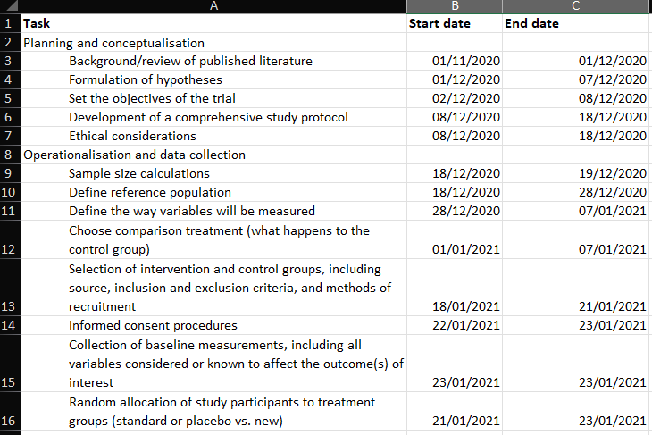
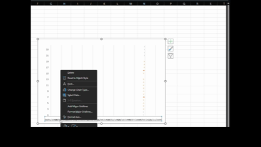

# Week 5 {#week5}

## Learning outcomes

This week, we are interested in taking a step back even further from the analysis of data. Last week, we spoke about **conceptualisation** and **operationalisation**, the steps that you take as a researcher to turn your ideas and topics of interest into variables to measure. But how do you then go about designing your research study? This week, we take a step back, conceptually, to the highest level of research oversight to consider the process of research design and consider the various ways that you can go about collecting data. 

Much of the data that we work with is collected as part of the research process. There are many different approaches to this process, and you will have come across a good sample of them in your readings.

**Research design** can be described as a general plan about what you will do to answer your research question. It is the overall plan for connecting the conceptual research problems to the pertinent (and achievable) empirical research. In other words, the research design articulates what data will be required, what methods are going to be used to collect and analyse the data, and how all of this is going to answer your research question. We will talk about **pre-registration** and the importance of separating confirmatory vs exploratory research. 

Both data and methods, as well as the way in which these will be configured in the research project, need to be the most effective in producing the answers to the research question (taking into account practical and other constraints of the study). Different design logics are used for different types of study, and the best choice depends on what sorts of research questions you want to be able to answer. 

Since your readings provide a comprehensive overview of different types of research designs, here we will cover some general practical points, with a focus on two different study designs. These are experiments and longitudinal studies. However, the skills we will practice today are relevant to data collected from various research designs. For example, we will learn about **missing data**, which can present important issues in cross-sectional, longitudinal, and other research designs. Similarly, we will explore a tool called the **Gantt chart** as a way to plan your study design, which can be applied to any form of research design. 

### Terms for today

- Research Design
    + Pre-registration
    + Confirmatory vs exploratory research
- Evaluation & Experiments
    + Randomised Control Trials (RCT)
    + Working with experimental data
-  Study Designs
    + The importance of time
    + Linking data 
- Missing data

## Research Design 

When designing your research, think of yourself as the project’s architect—creating the blueprint that outlines all essential tasks and elements. In crime and justice studies, research design critically shapes conclusions. Evidence shows that design systematically affects outcomes; for instance, randomised studies and strong quasi-experiments often yield significantly different results when evaluating interventions ([Weisburd et al., 2001](http://cebcp.org/wp-content/publications/Does%20Research%20Design%20Affect%20Study%20Outcomes.pdf)). 

Criminology and criminal justice researchers can draw from a wide range of methods, with the choice depending entirely on the research question. Such questions typically fall into four categories of research:

- (1) *descriptive* (define and describe the social phenomena), 
- (2) *exploratory* (identify the underlying meaning behind the phenomena), 
- (3) *explanatory* (identify causes and effects of social phenomena), and 
- (4) *evaluative* (determine the effects of an intervention on an outcome). 

While your readings provide detailed theoretical overviews of these approaches and their matching designs, today’s focus is on the practical nuances of research design. We’ll explore key tasks using examples from experimental and  studies in criminology—principles that apply to all research designs.

## Experiments and evaluation

Experimental criminology uses controlled methods to study cause and effect. Research designs fall into two broad classes: experimental and quasi-experimental. In experimental criminology, samples of people, places, schools, prisons, police beats, or other units of analysis are typically assigned (either randomly or through statistical matching) to one of two groups: either a new, innovative **treatment**, or an alternate intervention condition (**control**). Any observed and measured differences between the two groups across a set of “outcome measures” (such as crime rates, self-reported delinquency, and perceptions of disorder) can be attributed to the differences in the treatment and control conditions. Since the 1990s, the field of experimental criminology has expanded rapidly, with organisations such as the Campbell Collaboration, the Academy and Journal of Experimental Criminology, and the ASC’s Division of Experimental Criminology advancing rigorous experimental methods. These efforts have strengthened the evidence base for policy, promoting the use of randomised controlled trials and other robust designs to identify effective crime prevention and justice interventions.

- How much crime does prison prevent--or cause--for different kinds of offenders?
- Does visible police patrol prevent crime everywhere or just in certain locations? 
- What is the best way for societies to prevent crime from an early age?
- How can murder be prevented among high-risk groups of young men?

These and many other key questions in criminology are best addressed through randomised controlled trials (RCTs). This method involves assigning large samples of people or places (e.g., schools, prisons, police beats) randomly to different treatments. Any average differences in outcomes—such as crime rates—can then be attributed to the treatment itself, since random assignment minimises other potential sources of bias. That is because, with large enough samples, random assignment usually assures that there will be no other differences between the two groups except the treatment being tested.

For more on experimental criminology, read [Mazerolle and Bennett’s chapter](http://www.oxfordbibliographies.com/view/document/obo-9780195396607/obo-9780195396607-0085.xml)

### Activity: Examples of Experiments in Criminology

Below are two short videos to watch that show examples of how experiments can be used in Criminology. Take time now to watch these:

First, watch this [6-minute video from the University of Cambridge to learn a bit more about experimental criminology](https://www.youtube.com/watch?v=IGDF1-B1Yjs&feature=player_embedded). If you are in the BA Criminology programme, you may have seen this video before. If you are in the BASS program, it might be something new. 

And then [this video that describes the Philadelphia foot patrol experiment](https://www.youtube.com/watch?v=0NUQsK0vnnM). Pay attention to how the blocks are assigned to the treatment (foot patrol) and the control (normal, business-as-usual policing) groups. 

Take some notes about what you think are elements of the **research design** when you watch these videos; they will help you understand how and why we can use experiments in criminological research! Take time to get through these; it will help, but we also hope they are interesting examples of criminological research in action! Quantitative criminology isn't all about sitting around playing with spreadsheets and reading equations - we do get out sometimes and get to have an impact on things like policing!

Program evaluation is essential for determining what works—and what doesn’t—in crime prevention. As shown in the Philadelphia example, measuring the impact of foot patrols allowed police to demonstrate and advocate for effective interventions. However, knowing when an intervention fails is just as important. Consider the Scared Straight program, which began with a 1978 documentary featuring inmates aggressively confronting juvenile offenders. While distressing for participants, the program’s intent was to deter kids from future offending through fear. To justify such approaches, though, we must rely on rigorous evaluation to answer a simple but crucial question: Does it actually work?

### What influences what? Dependent vs independent variables

In these studies, we want to know whether some programme or intervention (e.g., Scared Straight) has any influence on some outcome (e.g., re-offending). In this case, our first task is to separate our dependent and independent variables to determine what we expect to have an impact on what. 

A dependent variable is what you aim to explain — it represents the outcome of interest. In contrast, the independent variable (or predictor) is what influences or explains that outcome. Dependent variables are also known as response or outcome variables because their values depend on those of the independent variable. One may even consider exploring whether one variable causes the variation in another variable – for example, a popular research study is that taller people are more likely to receive higher salaries. In this case, height would be the explanatory variable used to explain the variation in the response variable of salary.

For example, if your research asks, “Are older people more worried about crime?” then in this case, you believe that age will be influencing fear, right? In this case, since age is influencing fear, a person's level of fear of crime *depends* on their age. So, fear of crime is the dependent variable (the outcome), and age is the independent variable (the factor believed to influence it).

### Activity: Dependent and independent variables

What about in the case of an experiment? Let's return to our example with the Scared Straight programmes. We want to know whether Scared Straight has an effect on future offending, correct? So... what are our variables here? We want to know the effect of *Scared Straight* on the people's *future offending*. Our variables are in italics; they are: 

- exposure to the Scared Straight programme
- future offending behaviour.

Which influences which one? Well, the clue is always in our question. And our question is whether kids who participate in Scared Straight offend less than they would have if they didn't participate. So, for this, we know that we have one variable (in this case, offending) that *depends on* the other (participating in Scared Straight or not). What does this mean for which is the dependent variable and which is the independent?

Take a moment to try to answer this in small groups. Think about which one is *predicting* which *outcome* if the dependent/independent division doesn't work for you. You should definitely have a go at trying to guess here because we will give you the answer later, and it will help you check your understanding, and if you are unsure, then do discuss in your groups and ask the teaching team. The dependent/independent variable distinction will be important throughout your data analysis career!

Here is a corgi running around in circles before you get to the answer.

<i> REVEAL ANSWER </i>

Right, so now you're hopefully reading on after your own consideration, and you may have found that your **dependent variable** is the one that depends on the intervention, which is - whether the young person exposed to the Scared Straight programme offends or not. So, your *dependent* variable is *future offending*. This would have to be conceptualised (how far in the future, what counts as offending, etc.) and then, in turn, operationalised to be measured somehow. 

In this case, your *independent* variable is *participating in the Scared Straight programme*. Right? You are interested in whether participation will cause fewer offences in the future. Again, you would have to conceptualise Scared Straight participation (Can they go to one event? Do they have to attend many? Does it matter what happens to them? Whether they get yelled at or not? Whether they go into prison or not?) and then also operationalised in a way (Do we just measure did this young person ever take part as a yes/no categorical variable? Do we count the number of times they took part?).

But no matter how you conceptualise and operationalise these variables, you will still have to be able to determine the effect of one or the other. And the *research design* of your study will greatly affect whether or not you can do that. 

Experiments allow researchers to draw cause-and-effect conclusions by controlling for some variation and establishing which event occurs first — a key strength of experimental design. While *not* the only valid approach, it is especially powerful for evaluations. For a study to qualify as an experiment, it must include:

- Two comparison groups (treatment and control)

- Variation in the independent variable before changes in the dependent variable

- Random assignment to groups.

Let's talk about the two groups. These two groups are often called your **treatment** and your **control** groups because one group is administered some treatment (such as taking part in the intervention you are hoping to evaluate) while the other one receives the business-as-usual approach.

In the Philadelphia foot patrol example, treatment areas received foot patrols, while control areas did not. You then expose the treatment group to the intervention (the foot patrol). After this, you might find that the two groups are *different* in terms of the value of the independent variable (crime). But how can we know this difference is because one group had the treatment and the other didn't? Can't it be that the groups would have changed differently because of another reason?

## Importance of randomisation

This is why **random assignment** is important. This is why random assignment is crucial. It ensures that participants are assigned to treatment and control groups without bias, making the comparison fair and strengthening the ability to identify true treatment effects. Randomisation minimises systematic bias in assignment and differences between groups, enhancing the validity and reliability of causal conclusions and allowing researchers to generalise their findings with greater confidence.

> Consider the following criminal justice example. Two police precincts alike in all possible respects are chosen to participate in a study that examines fear of crime in neighborhoods. Both precincts would be pre-tested to obtain information on crime rates and citizen perceptions of crime. The experimental precinct would receive a treatment (i.e., increase in police patrols), while the comparison precinct would not receive a treatment. Then, twelve months later, both precincts would be post-tested to determine changes in crime rates and citizen perceptions.

-[Criminology and Criminal Justice Research: Methods - Quantitative Research Methods](http://law.jrank.org/pages/923/Criminology-Criminal-Justice-Research-Methods-Quantitative-research-methods.html)

You can read about these studies above for some examples of experiments in criminal justice research. In particular, the Philadelphia foot patrol experiment is an example of a **randomised control trial**. You will have read about a few types of experimental design in your textbooks, but here, we will focus on this particular one. The randomised controlled trial (RCT for short) is often considered the most rigorous method of determining whether a cause-and-effect relationship exists between an intervention and outcome. The strength of the RCT lies in the randomisation process, which is unique to this type of research study design.

Advantages

- Good randomisation will “wash out” any population bias
- Results can be analysed with well-known statistical tools
- Populations of participating individuals are clearly identified

Disadvantages

- Expensive in terms of time and money
- Volunteer biases: the population that participates may not be representative of the whole

### Activity: Random assignment 

How does random assignment work? Well, we could achieve this by going old-school and writing everyone's name on a piece of paper, and drawing the names out of a hat. But here, we will use Excel's ability to assign people to treatment or control groups. You are all Excel pros by now, with your formulas and pivot tables. So, I might as well hone these skills some more. 

To have a random assignment to a group, each member of your sample has to have the same probability of being selected for each group. Let's say we want to assign two groups. We want to assign people to a **control group** and a **treatment group**. Remember that the control and the treatment must be from the same sample, so that they are similar in all characteristics *except* in the particular thing you want to determine the effect of. By random assignment, each person has the same probability of being in the treatment or the control group. So there is no chance for systematic bias, as there would be, for example, if you were asking people to *self-select* into treatment or control. If people were given the chance to volunteer (*self-select*), it would leave open a possibility that people with certain traits are more likely to volunteer, and there might be some systematic differences between your two groups.  

Let's say we have our sample of people who will be assigned either to the treatment group receiving the Scared Straight treatment or the control group, who do not have to go through this treatment. Well, let's say we have our class here. We've got a total of 100 students enrolled in the class. Go ahead and download this list from Canvas. You can find it under the data folder for module learning materials week 5; it is called `student.xlsx`.

Once you have downloaded the data, open it with Excel and have a look at it. You can see that we have 100 rows, one for each student. You can also see that we have two variables: FIRST NAME and LAST NAME.

We can use Excel's `=RAND()` function to assign people randomly to a group. The Excel RAND function returns a random number between 0 and 1. For example, `=RAND()` will generate a number like 0.422245717. You might notice that this number will change - the `=RAND()` function recalculates when a worksheet is opened or altered. This will become important later. 

Give it a go. Create a new column called "random number" in our data. Now type `=RAND()` into the first cell and press Enter: 

When you hit enter, the formula will generate a random number between 0 and 1. Something like this: 

Did you get a different number for Ella there than we did? Chances are, you did. This `RAND()` function generates a random number each time it is used. If we repeat this process (on the same data), we will obtain a different result. Give it a try. Go into the cell where you've typed =RAND(), then go to the formula bar at the top and press ENTER again. You should now have another random number appear. Now drag the formula (press on the first cell you wrote the formula in, go to the bottom right corner, and double-click on the black plus sign that appears +) to every single student in our sample. You will end up with a whole range of values, between 0 and 1, randomly assigned to everyone. Something like this: 

We can use these values, which have been *randomly* created, to assign students to a control or treatment group. Remember last week when we were doing some re-coding? Remember when we were recoding the numeric variable into a categorical one? And we left a little bonus question at the end? The bonus question essentially asked what value you can use as a cut-off point to ensure that 50% of your data goes into one group and 50% into the other. This question should already be familiar to you, but let us rephrase: what measure of central tendency cuts your data right in half based on considering the values on a numeric variable? 

Are you thinking **median**??

Nice work! Indeed, the median is the value that divides our data right smack in half. Now, basically, if you want to assign each student, based on this randomly assigned score, to either control or treatment groups, and we want to make sure that equal amounts of students go to either group, then what we can do is use the `=IF()` statements we were using last week to re-code data!

How? Well, remember how we assigned people to tall or short categorical variable values based on their height? We decided that if a person is taller than average, they will be labelled "Tall"; otherwise, they will be labelled "Short". Then, what are the elements of our statement? We need to check *if* the person's height is *greater than* the *average height*, and if it is, type "Tall", else type "Short". Remember now? 

We can apply this again here. To recap, your function will look like this:

`=IF(condition, do if true, do if false)`

What is our condition here? Well, this time, we are using the median to divide our randomly assigned numbers into 2. We want to assign people to treatment or control based on whether their randomly allocated number is above or below the median. This ensures the *random* element of the randomised control trial and that people have an equal probability of ending up in either group. 

Let's say anyone with a random number above the median will be in the treatment group, and anyone with a random number below the median will be in the control group. What is our condition in this case? 

In this case, we are testing whether people's randomly assigned numbers exceed the median of all the random numbers. If their random number is greater than the median of all random numbers, then they are part of the treatment group (what happens if the condition is true). On the other hand, if their random number is **not** greater than the median of all the random numbers, then they are assigned to the control group (what happens if the condition is false). If any of this is unclear to you at the moment, then please raise your hand and ask one of us to explain this. 

Translated into Excel language, our formula is: 

`=IF(random number value > median(all random numbers), "Treatment", "Control")`

For example, for our first person in the list, the formula will look like: 

`=IF(C2 > MEDIAN(C:C), "Treatment", "Control")`

As such :

Hit 'Enter', and then copy the formatting all the way down so that everyone in the class has been assigned to the control and treatment groups. 

You should have something like this: 

Don't worry if you don't get the same values; as we said, this is *random*, so you should not consistently get the same answers. In fact, you should get different ones from your friends next to you as well. 

One way to sense-check your results is to examine your treatment and control groups. Let's see how many students we have in each. You can use a Pivot Table to do this and create a *univariate* *frequency table* to look at this new "Group" variable. 

You've built enough of these by now that you should be OK making this pivot table on your own, without guidance. If you get stuck on something, though, let us know!

If all goes well, your pivot table should let you know that you have 50 students in your control group and that minus 100 (your total) students in your treatment group (also 50): 

How did it go? Who's in your treatment, and who's in your control group? 

<!--
Where did you end up? Find your name in your sample. Are you in the treatment or the control group? What about in the spreadsheet of the person next to you? 

If you were assigned to the treatment group, as treatment [watch this Saturday Night Live skit on Scared Straight](https://www.youtube.com/watch?v=sw1vm_PO8ss). Let's see what it does for your offending...

If you were assigned to the control group, you can instead [watch this Saturday Night Live skit on Star Wars auditions](https://www.youtube.com/watch?v=-T_pjMr7-n0).
 

Now you've been exposed to either the treatment or the control condition. I'll be in touch in 12 months time to follow up, and find out about your offending behaviour. I'll report the results back in a paper. Science...!
-->

### Note: Freeze!

Before you're done here, there is one last thing to note. Remember when describing the `=RAND()` formula, we mentioned that RAND recalculates when a worksheet is opened or changed? Now, let's say we've assigned everyone to treatment or control conditions, and then we save our worksheet to return to it 12 months later. In 12 months, we may not wholly remember who was assigned to which group. However, if the random numbers are changed upon reopening, the assigned groups will also change. Since we don't want this, we want to somehow "freeze the values". 

You can do this by highlighting the GROUP column and going to Formulas > Calculation Options> and selecting "Manual":

On Mac: 

And on PC: 

This way, you can keep track of who was assigned to control and who was assigned to the treatment groups. 

##### IMPORTANT NOTE!!!

**When you have saved a static copy of your allocations, be sure to untick this to go back to Automatic calculations, otherwise your future formulas won't update!**

## Designing your study

Once you have an idea for your study, even before you select your participants and assign them to their groups (treatment vs control), you need a very clear, very solid plan of action for how you will conduct this study. This is called your **research design**. This is important not only to ensure you have all the necessary resources (time, funding, staff/people power) to complete your study but also to provide a clear understanding of your expected outcomes, which you can then communicate to yourself, your research team, and the wider scientific community. 

### Pre-registration: committing to your research plan

Pre-registration enhances the quality of your science by increasing the credibility of your results. It allows you to stake your claim to your ideas earlier, facilitating better research planning. 

When you preregister your research, you're simply specifying your research plan in advance of your study and submitting it to a registry. This will help to improve your research. By writing out specific details such as data collection methods, analysis plans, and rules for data exclusion, you can make important decisions early on and have a clear record of these choices. This can help reduce biases that occur once the data are in front of you.

Preregistration further separates hypothesis-generating (**exploratory**) from hypothesis-testing (**confirmatory**) research. Both are important. But the same data cannot be used to generate and test a hypothesis, which can happen unintentionally and reduce the credibility of your results. Addressing this problem through planning improves the quality and transparency of your research. This helps you clearly report your study, enabling others to build on it.

Let's explore the difference between the two.

#### Confirmatory vs Exploratory Research

**Confirmatory Research**

- Hypothesis testing
- Results are held to the highest standards
- Data-independent
- Minimises false positives
- P-values retain diagnostic value
- Inferences may be drawn to the wider population

**Exploratory Research**

- Hypothesis generating
- Results deserve to be replicated and confirmed
- Data-dependent
- Minimises false negatives in order to find unexpected discoveries
- P-values lose diagnostic value
- Not useful for making inferences to any wider population

It is important that you are clear from the start about the type of research you want to carry out, and planning can really help with that!

The Turing Way, an open-source community-driven guide to reproducible, ethical, inclusive and collaborative data science, have a (beautifully illustrated!) [Guide to Research Design](https://the-turing-way.netlify.app/project-design/project-design.html) that you can take time to scroll through.

Here, we’ll explore a tool to help you organise and manage each stage of your research process. By breaking your project into individual tasks and assigning timeframes, you can better estimate how long your study will take. One effective project planning tool for this is a Gantt chart. We’ll demonstrate its use by planning an RCT evaluating the Scared Straight program — but Gantt charts can be applied to any research project, including your future dissertation.

#### What is a Gantt chart?

A Gantt chart, commonly used in project management, is one of the most popular and practical ways of showing activities (tasks or events) displayed against time. On the left of the chart is a list of activities, and along the top is a suitable time scale. Each activity is represented by a bar; the position and length of the bar reflect the start date, duration and end date of the activity. This allows you to see at a glance:

- What the various activities are
- When each activity begins and ends
- How long each activity is scheduled to last
- Where activities overlap with other activities, and by how much
- The start and end date of the whole project

To summarise, a Gantt chart shows you what has to be done (the activities) and when (the schedule). It looks like this: 

To be able to build a Gantt chart, you need to know the following about your project: 

- The tasks required to carry it out
- The length of time available for the whole project
- Approximate start and finish dates for the individual tasks

Gantt charts help ensure your project is feasible within the available time and resources. They prompt you to identify major tasks (e.g., data collection) and break them into smaller steps (e.g., identify population, plan sampling, recruit participants, deploy survey, collect responses, enter data). Estimating the time and resources needed for each step helps you assess feasibility and plan efficiently.

In research design, this is invaluable. For instance, when planning an RCT to evaluate Scared Straight, turning the project outline into a Gantt chart allows you to visualise the timeline, required resources, and overall practicality of conducting the study.

Let's start with the basic outline.

### Activity: Research Planning with Gantt Charts: Design an RCT example

In this activity, we're going to plan an RCT using a Gantt Chart. 

The basic outline of the design of a randomised controlled trial will vary from trial to trial. It depends on many, many factors. The rough outline for our research design will follow something like this: 

- Planning and conceptualisation
- Operationalisation and data collection
- Data analysis
- Writing up of results 

This is not necessarily always a linear process. It can be that after data analysis, you return for more data collection or even go back to the conceptualisation stage. But as we mentioned above, the Gantt chart aims to break down these tasks into the smallest possible components. Why is this?

Let's start by building a Gantt chart with just these elements to illustrate. As seen above, you need to know the approximate duration of your project, including the tasks and their respective time requirements. 

Let's say that we have 1.5 years to carry out our RCT for Scared Straight. This is our approximate duration. We also have our list of tasks up there. But how long will each of these take? How long should you budget for Planning and conceptualisation? What about operationalisation and data collection or data analysis? Please take a moment to think about this and discuss it in small groups.

Was it difficult to estimate? Why would you think that is? Would it be easier if you had more experience with research? Probably not by much. Each research project comes with its own complexity and nuance, and estimating the time required for something as vague as "data analysis" is an incredibly tough task, even for the most seasoned researcher. Instead, to better estimate the length of tasks, break them into their components, which can give you a better indicator of how long things will take. 

Let's try this for the Scared Straight RCT. 

Let's start with our main overarching categories for the above, but break each one down into its components. Something like this: 

- Planning and conceptualisation
    + Background/review of published literature
    + Formulation of hypotheses
    + Set the objectives of the trial
    + Development of a comprehensive study protocol
    + Ethical considerations
- Operationalisation and data collection
    + Sample size calculations
    + Define reference population
    + Define the way variables will be measured
    + Choose comparison treatment (what happens to the control group)
    + Selection of intervention and control groups, including source, inclusion and exclusion criteria, and methods of recruitment
    + Informed consent procedures
    + Collection of baseline measurements, including all variables considered or known to affect the outcome(s) of interest
    + Random allocation of study participants to treatment groups (standard or placebo vs. new)
    + Follow-up of all treatment groups, with assessment of outcomes continuously or intermittently
- Data analysis
    + Descriptive analysis
    + Comparison of treatment groups
- Writing up of results 
    + Interpretation (assess the strength of effect, alternative explanations such as sampling variation, bias)
    + First draft
    + Get feedback & make changes
    + Final write-up of results

So, how do you come up with individual sub-elements? Well, there is no simple answer to this; the way that you come up with these categories is by thinking about what you need to do in each stage to achieve your goals. What do you need to do to collect your data? What are all the steps and actions that you need to take to reach your end goal of a set of data that you can analyse to be able to talk about the difference between your control and treatment groups? 

<!-- What do you need to do when you write up? What are the stages of writing up? How long do each one of these normally take you? There are some people who can write a rough 1st draft quickly and send it to a colleague for comments and feedback. Others need to be very comfortable with their draft first and spend more time on it before they can show someone else to receive comments. Because of this, not only does each project have nuances and differences when building a Gantt chart, but each person will also have. -->

This exercise aims to help you think about projects in this way, while also illustrating how to create a visual timeline from the above information. This timeline can aid in planning your research project and ensuring it runs on time. So, let's build a Gantt chart for our RCT of the Scared Straight programme, using the tasks above to guide us. 

If you were doing this for your own project, you would have to write down all the tasks in Excel. For this example, the tasks have been written for you. You can download this from Canvas, Learning materials for week 5, Gantt_chart_example.xlsx.

The example you downloaded has 4 columns: 

- Task
- Start date
- End date
- Duration

The *Task* column refers to each activity, which are the detailed steps that we have to take, in order to be able to complete our project. These are all the activities that we've broken the tasks into. If we were considering this Gantt chart table as a data set, you can now begin to guess that our unit of analysis is the *task*. Each activity we have to do is one row. These include the bigger group that each sub-task belongs to and the sub-tasks themselves. This will be meaningful later on. 

In the other columns, *start date*, *end date*, and *duration*, the temporal information around each task is recorded. The Gantt chart serves as a tool to help you plan your research project. Great, but how can we know how long something will take? We don't have a crystal ball. But we can *guess*. We can start with the project start date (or if you work better, counting backwards, you can start with the project end date if it's a known hard deadline), and then just try to estimate how long each phase will take to complete, and when we can start the next. 

Tasks can run simultaneously. You don't always have to wait for one task to finish before you start the next. Sometimes, one task needs to be completed before the next one starts; for example, you cannot begin data analysis until you have finished data collection. On the other hand, you can (and should) start writing while continuing your data analysis. So, you can have temporal overlap or work on multiple projects simultaneously. 

The example provided in the downloaded Excel sheet used some very rough guessing and [this proposed outline](https://www.healthknowledge.org.uk/e-learning/epidemiology/practitioners/introduction-study-design-is-rct) for RCTs, to come up with a tentative timeline. You can change the proposed timeline and come up with how long you think each stage will take you.

<!-- First, you will have to open a new Excel spreadsheet. Just a blank one. We'll be building our Gantt chart from scratch. 
So once you have your blank Excel sheet, create 4 columns:

- Task
- Start date
- End date
- Duration

Something like this: 

The *Task* column refers to each individual activity, which are the detailed steps that we have to take, in order to be able to complete our project. These are all the activities that we've broken the tasks into. If we were considering this Gantt chart table as a data set, you can now begin to guess that our unit of analysis is the *task*. Each activity we have to do is one row. These include the bigger group that each sub-task belongs to and the sub-tasks themselves. This will be meaningful later on. 
In the other columns, *start date*, *end date*, and *duration*, we will record the temporal information around each task - that is - when will it start? When will it end? How long will it take?

So, as a first step, let's populate the *task* column. You can copy and paste from the list above. It should look something like this: 

Great, now how will we populate the start date and end date columns? This is where the Gantt chart is very much a tool for you to plan your research project. How can we know how long will something take? The short answer is we can't.  We don't have a crystal ball. But we can *guess*. We can start with the project start date (or if you work better counting backwards, you can start with the project end date if it's a known hard deadline), and then just try to estimate how long each phase will take to complete, and when we can start the next. 
Tasks can run simultaneously. You don't always have to wait for one task to finish before you start the next. Sometimes, one task needs to be finished before the next one starts; for example, you cannot begin data analysis until you have finished data collection. On the other hand, you can (and should) begin writing while still continuing your data analysis. So you can have temporal overlap - or be working on multiple projects at once. 
Now, let's say that we are starting our Scared Straight evaluation quite soon; we have a start date of the 1st of November. Using some very rough guessing and [this proposed outline](https://www.healthknowledge.org.uk/e-learning/epidemiology/practitioners/introduction-study-design-is-rct) for RCTs, we can come up with a tentative timeline:
- Background/review of published literature:	01/11/20	to 01/12/20
- Formulation of hypotheses	01/12/20	07/12/20
- Set the objectives of the trial	02/12/20	08/12/20
- Development of a comprehensive study protocol	08/12/20 to 18/12/20
- Ethical considerations	08/12/20 to	18/12/20
- Sample size calculations	18/12/20 to	19/12/20
- Define reference population	18/12/20 to	28/12/20
- Define the way variables will be measured	28/12/20 to	07/01/21
- Choose comparison treatment (what happens to the control group)	01/01/21 to	07/01/21
- Selection of intervention and control groups, including source, inclusion and exclusion criteria, and methods of recruitment	18/01/21 to	21/01/21
- Informed consent procedures	22/01/21 to	23/01/21
- Collection of baseline measurements, including all variables considered or known to affect the outcome(s) of interest	23/01/21 to	23/01/21
- Random allocation of study participants to treatment groups (standard or placebo vs. new)	21/01/21 to	23/01/21
- Follow-up of all treatment groups, with the assessment of outcomes continuously or intermittently	24/01/21 to	23/01/22
- Descriptive analysis	24/01/22 to	24/02/22
- Comparison of treatment groups	30/01/22 to	24/02/22
 - Interpretation (assess the strength of the effect, alternative explanations such as sampling variation, bias)	20/02/22 to	20/03/22
- First draft	20/03/22 to	25/03/22
- Get feedback & make changes	25/03/22 to	05/04/22
- Final write-up of results	05/04/22 to	30/04/22

You should be able to copy this over into Excel if you roughly agree with these time scales. If not, you can do this yourself and come up with how long you think each stage will take you. -->

Notice that we did not give a start or end time to the *overarching categories* of planning and conceptualisation, operationalisation and data collection, data analysis, and writing up of results. We mentioned earlier that these categories are so vague that it becomes a challenging task to guess their duration. Instead, we break them down into smaller tasks and calculate those. Well, to determine the start and end dates for the overarching tasks, simply use the first start date of the first task and the last end date of the last task within this overarching group. How can we find this? Well, we can use the `=MIN()` and the `=MAX()` functions in Excel. 

Ensure you only select sub-tasks that belong to each individual overarching task. So, for example, for Planning and conceptualisation, only select up until "Ethical considerations" and *do not* also include the "Operationalisation and data collection" stage!

Excel may automatically reformat your dates (e.g., showing 01-Dec instead of 22/01/19) because it recognises entries in the dd/mm/yy pattern as dates. If your Start and End date columns are not formatted accordingly, now is the time to rectify that, using the Format option. This is useful, as it allows you to perform calculations with those cells—something you couldn’t do if Excel treated them as plain text. We will take advantage of this to calculate the duration column here.

For example, to calculate the duration between two dates, simply subtract the start date from the end date. Excel will return the number of days between them—handy for planning tasks like assigning participants to treatment and control groups. We’ll explore more date-related Excel tricks in week 9!

<!--You might find that Excel changes the formatting of your dates in some of the cells. You can see in those the date is formatted as 01-Dec, for example, whereas later, it is formatted the way we entered it, such as 22/01/19. This is because Excel *knows* that the value you are entering here is a *date*.  It doesn't just think you're entering some weird words; it deduces that if what you are entering follows this rough format of 2 digits/ 2 digits / 2 digits, then it's likely to be a date. This is really handy because you can do calculations on these cells now, which you would not be able to do if Excel had just thought that these were weird words. 
We will take advantage of this to calculate the duration column here. Do you really want to count how many days are between the start and end date? Well, in some cases, it might be easy. It could be that you thought, "Well, I will start my random allocation of study participants into treatment and control groups on the 21st of January, and I think it will take about 2 days to do this, so I will end on the 23rd of January", but often you will have deadlines, that you need to work towards, or you might want to double-check that you are counting correctly. In any case, to get the last, *duration* column, you can simply use an equation where you subtract the start date from the end date, and you get the number of days that are in-between. Isn't that neat? You can simply apply some simple maths notations to your date data in Excel, and you get meaningful results, such as the number of days that exist between two dates! We will play around more with dates and such in week 9 of this course, so you can see some more date-related tricks then! -->

Right, back to our dates, so remember, all formulas start with the `=` equation, and here, all we are doing is subtracting the value of one cell (start date) from another cell (end date). Like so: 

Copy and paste the formatting all the way down, and ta-daa, you have your column for the duration of each task:

Now, you have all the columns you need to build your Gantt chart. 

To do this, click on an empty cell anywhere *outside* your table and select Insert > Charts > Stacked Bar Chart: 

An empty chart will appear like so: 

Right-click anywhere in the empty chart space, and choose the option "Select Data...":

On a Mac: 

On a PC: 

This will open a dialogue box. This dialogue box might look different if you're on PC or on Mac (and even on Mac, your version will be newer than mine, so it might look slightly different), but the basic commands should be the same. If you cannot find anything, let us know!

So on this popup window, select the option to *Add* data. 

On PC: 

On Mac: 

When you select this option, you have to supply 2 values to this series. First, you have to tell it the name. This is simply the cell that contains your column header. Then you have to tell it the values. These are all your start dates. You can select by clicking in the blank box for each value and then clicking/drag-dropping on the spreadsheet. Like so: 

When you're done, click "OK". 

On a PC, when you click the "Add" button, it will open a new window, but again, all you have to enter in that new window is the name and the values, the exact same way. Here is an illustrative example of what this will look like on PC: 

Now click OK, and you will see some bars appear, reaching each start date that we have. Now we have to add the *duration*. To do this, just repeat the steps to add a series, but with the duration column this time.

The part that appears in red above represents the duration of each task. The blue part now is actually redundant. We just needed it there, so that the red part (the actual task) begins at the correct point. So we clear the fill, we clear the line, and in case there is a shadow there, we clear that as well so that we don't confuse ourselves by having that blue part there. This is how we can clear these sections. First, click on the blue section of the graph to select it: 

And then right-click and choose 'Format Data Series...':

Then, on the side tabs, you can go through and select fill, line, and even shadow, and make sure that they are all set to no fill/ no line/ no shadow: 

Then click OK, and you will see only the red parts of your graph, which represent each task and the duration it lasts: 

**NOTE**: you might have an issue where Excel starts counting at the year 1900 for some reason. In that case, your chart might have looked like this: 

In this case, you can fix this by editing the axis through right-click, format axis, put in the correct minimum (start date), like so: 

Now, you have a timeline for each task, but how do you know what each task is? We just see numbers. Well, we need to add the labels from the task column of your data to give it some sort of meaning. To do this, once again right-click anywhere on your chart area and select "Select Data...", this time, for where it asks for axis labels, click in that box and then highlight the column with the tasks in it: 

On a PC, you will have to click the "Edit" button under the "Horizontal category axis labels" box. This will look something like this: 

When you then select the column with the tasks in it and click OK, it should label your tasks properly now: 

Now, your Gantt chart is basically ready. Yours may look a bit different. If this is the case, return to your data and sort it by the "End date" column. If you do this, then you will have your first tasks at the top and the last task at the bottom. This should help you plan your tasks. You can take some time to edit your Gantt chart formatting to make it look the way that you would find most helpful. For example, here's mine: 

So what's going to take the longest? As you can see there, the longest duration is for the operationalisation and data collection tab. It's an overarching category, but there are no sub-tasks associated with it for the majority of its duration. Well, the thing is, even though we have not actively collected data for that long period, we are still in the data-collection phase. Can you think why?

We want to know if Scared Straight works on reducing offending, right? For this, we need to recruit our people, assign them to a control and a treatment group, and then *wait for a pre-determined amount of time* before we can collect the follow-up data - or the *after* data. Remember, back to conceptualisation. How do we conceptualise re-offending? Well, in this case, we conceptualise it as if the person has offended in the 12 months following taking part in the Scared Straight programme. Because of this, we have to wait 12 months until we collect our "after" data. 

Planning is a crucial part of any research project, and your chosen research design directly shapes that plan. For instance, instead of running an RCT on the Scared Straight program, you might conduct a cross-sectional survey—asking participants if they’ve taken part in the program and whether they’ve offended in the past year. While much simpler and faster to complete, this design only captures data at one point in time and cannot determine cause and effect as effectively as an RCT. The advantages of an RCT over a cross-sectional survey in terms of determining the effect of an intervention are widely discussed in your readings.

Choosing the optimal design depends on your research question. If you aim to test whether Scared Straight truly works, an RCT is ideal. However, it’s not the only method for exploring causal relationships—many other designs can also yield valuable insights.

<!-- Planning is a very important part of the research project, and the research design which you pick will greatly affect your research plan. Think about whether we should consider a one-time survey instead. We could ask people - "have you ever taken part in a scared straight programme?" And then ask them, "Have you offended in the last 12 months?". But this is a **cross-sectional** study design, in which we only take measurements at one point in time. This is a very different study design, and the advantages of an RCT over a cross-sectional survey in terms of determining the effect of an intervention are widely discussed in your readings. However, you can also imagine how it would be an easier study to carry out, right? The data collection part of your Gantt chart there would reduce significantly, from over 12 months to something much shorter, just the length of time it takes to conduct one survey. 
Hopefully, you are beginning to get an idea of the nuances of finding your optimal research design. To a certain extent, this is dictated by your research question. If you want to know whether scared straight works or not, and you want to design a study to assess this, an RCT might be your ideal way forward. However, RCTs are not the only way to achieve causal inference; of course, there are many other methods and study designs you might be able to use. -->

For example, in the paper ['Behavioral nudges reduce failure to appear for court'](https://science.sciencemag.org/content/early/2020/10/07/science.abb6591/tab-pdf), Alissa Fishbane and colleagues take advantage of a gradual roll-out of intervention and use [regression discontinuity](https://methods.sagepub.com/reference/encyc-of-research-design/n375.xml) approach to find that re-wording a court summons actually helps people turn up for their court date, and reduces arrests!

There are many research designs to choose from, and the best one depends on your research question, available resources, and feasibility. For example, while an RCT might be ideal, it may not be practical within the limited timeframe of a third-year dissertation. In that case, you may need to adjust your design — and possibly your research question — to fit your constraints. If your focus is on factors influencing reoffending over an extended period, a  design may be more appropriate than an experiment. Next, we’ll explore this design further and introduce two key concepts: linking data and missing data.

<!-- So, there are many research designs, and you want to think about which one best fits your research questions. However, there are other things to consider around your access to resources and the feasibility of the study you propose within your given constraints - maybe you want to plan an RCT, but you are doing this in the context of your 3rd-year dissertation project, which has a much shorter timeline than required - in this case, you might need to re-think your research design to fit within your constraints, and that may affect the kind of research questions you might be able to answer. Maybe you are concerned about the effect of other things on reoffending that are difficult to implement into an intervention programme. It might be something you need to observe over a long time, much longer than an experiment might allow. In this case, maybe a  design is what you are after. We will now introduce longitudinal research design to learn about two more important concepts: linking data and missing data! -->

## Longitudinal data

There are two commonly used longitudinal research designs, **panel** and **cohort** studies. Both study the same group over a period of time and are generally concerned with assessing within - and between-group change. Panel studies follow the same group or sample over time, while cohort studies examine more specific populations (i.e., cohorts) as they change over time. Panel studies typically interview the same set of people at two or more periods of time. 

For example, the 1970 British Cohort Study (BCS70) follows the lives of more than 17,000 people born in England, Scotland and Wales in a single week of 1970. Over the course of cohort members' lives, the BCS70 has broadened from a strictly medical focus at birth to collect information on health, physical, educational and social development, and economic circumstances, among other factors.

The Millennium Cohort Study (MCS), which began in 2000, is conducted by the Centre for Longitudinal Studies (CLS). It aims to chart the social, economic, and health advantages and disadvantages facing children born at the start of the 21st century.

Our Future (formerly the Longitudinal Study of Young People in England (LSYPE2)) is a major longitudinal study of young people that began in 2013. It aims to track a sample of over 13,000 young people from the age of 13/14 annually through to the age of 20 (seven waves).

These are some examples from the UK Data Service ([see those and more here](https://www.ukdataservice.ac.uk/get-data/key-data/cohort-and-longitudinal-studies)).

The main advantage of longitudinal studies is that you can track change over time, and you meet the temporal criteria for causality. You collect data from people across multiple **waves**. Waves refer to the times of data collection in your data. For example, if you follow a cohort from birth until their 30th birthday, and you take measurements every 10 years, once at the point of birth, once at age 10, once at age 20, and finally at age 30, then you will have 4 waves in this longitudinal data about these people you're following. 

### What does longitudinal data look like?

So far, we've only looked at cross-sectional data, where each row represents one observation and each column one variable, all collected at a single point in time. Longitudinal data, by contrast, include repeated measurements of the same subjects—people, neighbourhoods, etc.—across multiple time points. When these repeated observations focus on a single variable over time (e.g., the crime rate in a city), the design is called a time series. Time-series studies are useful for examining changes over time, such as the impact of new laws or programs. For example, we might track burglary rates across Greater Manchester boroughs over the past five years. (We'll explore time-series analysis in week 9.)

Okay, so, what does longitudinal data actually look like? One example is the [Next Steps (formerly the Longitudinal Study of Young People in England (LSYPE1))](https://discover.ukdataservice.ac.uk/series/?sn=2000030), which follows around 16,000 people born in 1989–90 in England. The first seven waves (2004–2010), run by the Department for Education, focused on participants’ education and early careers.

Starting with Year 9 students in 2004, participants were surveyed annually until 2010, with their data linked to the National Pupil Database, including Key Stage 2–4 scores. In 2013, the study moved to the Centre for Longitudinal Studies (CLS) at UCL, which relaunched it in 2015 to explore participants’ lives at age 25, expanding into broader social and economic topics. A second study under the same programme, Our Future (LSYPE2), began in 2013, tracking over 13,000 young people from ages 13/14 to 20 (seven waves).

These datasets include rich information on youth behaviour—such as drug and alcohol use, offending (graffiti, vandalism, shoplifting), and family and social factors. If you are interested in the data, you can always browse through the [site here](https://discover.ukdataservice.ac.uk/Catalogue/?sn=5545&type=Data%20catalogue&lt) and [have a read of one of the questionnaires as well](http://doc.ukdataservice.ac.uk/doc/5545/mrdoc/pdf/age_25_survey_questionnaire.pdf).

<!-- Okay, so how does this data actually look like? You can have a look at the description for the [Next Steps (formerly the Longitudinal Study of Young People in England (LSYPE1))](https://discover.ukdataservice.ac.uk/series/?sn=2000030). Briefly mentioned above, the Next Steps (formerly the Longitudinal Study of Young People in England (LSYPE1)) is a major longitudinal study that follows the lives of around 16,000 people born in 1989-90 in England. The first seven sweeps of the study (2004-2010) were funded and managed by the Department for Education (DfE) and mainly focused on the educational and early labour market experiences of young people.

The study began in 2004 and included young people in Year 9 who attended state and independent schools in England. Following the initial survey at ages 13-14, the cohort members were interviewed every year until 2010. The survey data have also been linked to the National Pupil Database (NPD) records, including cohort members’ individual scores at Key Stage 2, 3 and 4.

In 2013, the management of Next Steps was transferred to the Centre for Longitudinal Studies (CLS) at the UCL Institute of Education and in 2015, Next Steps was restarted under the management of CLS to find out how the lives of the cohort members had turned out at age 25. It maintained a strong focus on education, but the content was broadened to become a more multi-disciplinary research resource.

Two separate studies have begun under the LSYPE programme. The second study, Our Future (formerly LSYPE2), began in 2013 and will track a sample of over 13,000 young people from the age of 13/14 annually through to the age of 20 (seven waves).

There are a lot of interesting variables for those interested in young people and delinquent behaviour. There is some data about drugs and alcohol, some about offending such as graffiti, vandalism, and shoplifting, as well as social control factors such as family relationships, bullying, and so on. If you are interested in the data, you can always browse through the [site here](https://discover.ukdataservice.ac.uk/Catalogue/?sn=5545&type=Data%20catalogue&lt) and [have a read of one of the questionnaires as well](http://doc.ukdataservice.ac.uk/doc/5545/mrdoc/pdf/age_25_survey_questionnaire.pdf).  

In any case, we should get back to our question: what does this data look like? And it looks exactly as you would imagine, it looks like the results of survey questionnaires, completed by people, but over time. If you were to download The Next Steps data, for example, you would end up with a separate file for each wave. But in each wave, you would have **repeat measures** of the same variables from the same people. So, in each wave, you see the exact same variables and the exact same people making up the rows of answers, but you know that time has passed. 

The benefit of a longitudinal study is that researchers are able to detect developments or changes in the characteristics of the target population at both the group and the individual level. The key here is that longitudinal studies extend beyond a single moment in time. As a result, they can establish sequences of events. It is generally admitted that causes precede their effects in time. This usually justifies the preference for longitudinal studies over cross-sectional ones because the former allows the modelling of the dynamic process generating the outcome, while the latter cannot. Supporters of the longitudinal view make two interrelated claims: (i) causal inference requires following the same individuals over time, and (ii) no causal inference can be drawn from cross-sectional data. 

Anyway, have a look at a small subset of 3 waves of the data. There are 4 variables in each wave. The first one,  "NSID", is the unique identifier for each person. Then, three variables contain the answers that each person gave to some questions. * W1canntryYP*	is the answer to whether the young person ever tried Cannabis. *W1alceverYP*	is the answer to whether the young person ever had a proper alcoholic drink (yes, yes, the survey question does ask "proper" alcoholic drink; see [data dictionary](http://doc.ukdataservice.ac.uk/doc/5545/mrdoc/ukda_data_dictionaries.zip)), and *W1cignowYP* is the answer to whether the young person ever smoked cigarettes. ! -->

In any case, we should get back to our question: what does this data look like? Just as you’d expect—it’s survey questionnaire responses collected from the same people over time. If you downloaded the Next Steps data, you’d find a separate file for each wave. Each wave contains repeated measures of the same variables for the same individuals—identical variables, same participants, but recorded at different points in time.

The advantage of longitudinal studies is that they allow researchers to track changes and developments within individuals and groups over time. Because they capture events in sequence, they can help establish causal relationships—since causes must occur before effects. This makes longitudinal data more powerful than cross-sectional data for studying dynamic processes and identifying potential causal links.

Below is a small subset from three waves of the data, each with four variables. The first, NSID, is a unique ID for each person. The next three are survey responses:

- W1canntryYP – whether the respondent has ever tried cannabis
- W1alceverYP – whether they’ve ever had a “proper” alcoholic drink (yes, yes, the survey question does ask "proper" alcoholic drink; see [data dictionary](http://doc.ukdataservice.ac.uk/doc/5545/mrdoc/ukda_data_dictionaries.zip))
- W1cignowYP – whether they’ve ever smoked cigarettes

You can download these three waves of young people being surveyed from Canvas. You can find them labelled wave_1.xlsx, wave_2.xlsx, and wave_3.xlsx in this week's data folder. Download all three on your computer and open them up in Excel. 

### Activity: Linking data

<!-- Hopefully, if we've taught you anything about the structure of data, is that you have *all* your observations in your rows and *all* your variables in your columns. If you want to be able to look at changes in people's responses over time, for example, you will need to be able to link these data sets together into one spreadsheet. 

How do we do this? Well, you can link one data set to another. Data linking is used to bring together information from different sources in order to create a new, richer dataset. This involves identifying and combining information from corresponding records on each of the different source datasets. The records in the resulting linked dataset contain some data from each of the source datasets. Most linking techniques combine records from different datasets if they refer to the same entity. (An entity may be a person, organisation, household or even a geographic region.) 

You can merge (combine) rows from one table into another just by pasting them in the first empty cells below the target table—the table grows in size to include the new rows. And if the rows in both tables match up, you can merge columns from one table with another by pasting them in the first empty cells to the right of the table—again, the table grows, this time to include the new columns.

Merging rows is pretty straightforward, but merging columns can be tricky if the rows of one table don't always line up with the rows in the other table. By using `VLOOKUP()`, you can avoid some of the alignment problems.

To merge tables, you can use the VLOOKUP function to look up and retrieve data from one table to the other. To use `VLOOKUP()` this way, both tables must share a common ID or key.

This is a standard "exact match" `VLOOKUP()` formula (remember that means you have to set the last parameter to 'FALSE' for an exact match). ! -->

Hopefully, if we've taught you anything, by now, about the structure of data, is that you have *all* your observations in your rows and *all* your variables in your columns. To study how people’s responses change over time, you need to link datasets from different waves into one combined file.

Data linking brings together information from different sources to create a richer dataset. It involves matching and combining records that refer to the same entity—such as a person, household, or area—so each linked record contains data from multiple sources.

You can merge datasets by adding rows (stacking observations) or columns (adding new variables). Adding rows is simple—you just paste one table beneath another. Adding columns, however, is trickier if the rows don’t line up perfectly.

That’s where VLOOKUP() comes in. It allows you to match rows across tables using a common ID (it will not work if this is not available) or key (like a person identifier) and pull in the correct information. Remember to use an exact match by setting the last parameter in VLOOKUP() to FALSE.

First things first. Open up all three waves in three separate Excel spreadsheets. Have a look at them all. You can see the first one has the following columns: 

- *NSID*: the unique ID
- *W1canntryYP*: ever tried cannabis	
- *W1cignowYP*: ever smoked	
- *W1alceverYP*: ever had alcohol

Then, you can have a look at wave 2. You will see in wave two that the unique ID column stays the same (*NSID*: the unique ID), but the other three columns are named slightly differently: 

- *W2canntryYP*: ever tried cannabis	
- *W2cignowYP*: ever smoked	
- *W2alceverYP*: ever had alcohol

It might be a subtle difference, but the first two characters in each variable name indicate the wave in which the data were collected. This is very useful—if the variables were simply named canntryYP, cignowYP, and alceverYP, it would be unclear which wave each came from once the datasets were combined. While you could rename them manually, it’s convenient that these variables were already labelled with the wave number, making data merging much easier.

If you're still curious, have a look at wave 3, where you will see the familiar NSID column, as well as these three: 

- *W3canntryYP*: ever tried cannabis	
- *W3cignowYP*: ever smoked	
- *W3alceverYP*: ever had alcohol

Why doesn't the NSID column change? Well, this is the same value for all participants throughout. This is so that we can identify each one. Due to ethics and the Data Protection Act, we cannot share data that contains personally identifiable information, especially in cases where it refers to some pretty sensitive stuff, such as someone's drug use, alcohol use, or some delinquent behaviour. Instead, each person is given a unique code. This code can be used to track them over time without identifying them personally. 

To join datasets, you need a *unique* identifier for each row in all the datasets you want to combine. This is how Excel knows which values belong together. Essentially, you’re matching rows across tables using this shared ID column.

For example, imagine two datasets from people in Hawkins, Indiana: one contains their ages, and the other their hair colours. If both datasets include a unique, matching piece of information—say, each person’s name—you can link them using that identifier. It would look something like this:

By doing so, we produce a final table that contains all values, lined up *correctly* for each individual observation, like this: 

This is all we do when merging tables: we make sure the correct values line up for all variables and all our observations. 

Let's do this with our datasets. Let's say we want to look at the extent of cannabis, alcohol, and cigarette trying in each wave of our cohort as they age. To do this, we need to link all the waves into a single dataset. We have established that the variable *NSID* is unique to each person, so we can use that to link their answers in each wave. 

So remember the parameters you need to pass to the `VLOOKUP()` function, from last week? You need to tell it:

- first *what value to match*, 
- then *where the lookup table is*, 
- then *which column of this table you want*, 
- and finally *whether or not you want an exact match*. 

In this case, we want to match the unique identifier found for each person in the *NSID* column. This is the value to match. Then our lookup table is now *the other data set* which we want to link. The column will match what we are copying over, and we will set the exact match parameter to "FALSE" (meaning we *do* want exact matches only). 

What does this look like in practice? 

Well, let's open up our wave 1 (well, technically, you have them all open, so just bring wave 1 to the front). We don't want to overwrite this file, so save it as something new. Do this by selecting File > Save As/ Save a Copy..., choosing where to save it, and giving it a name. Here, we will save it in the same folder where we've saved the individual waves data and call it "next_stepsw1-3.xlsx" as it will contain waves one through three of The Next Steps longitudinal survey:

Now that you have this as a new file (which already contains the data from wave 1), you can get ready to merge in the data from waves 2 and 3. First, let's create column headers for the variables we will copy over. You can do this by simply copying over the column headers from the other data sets (waves 2 and 3). Like so: 

Notice that we are not copying over the NSID column. This is because it would be exactly the same. It's enough to have this once. If you are participant NS23533L, you will always have this value for the NSID column. This is used to match all your answers and to copy over into this sheet, but it is *not* itself copied over. If this is confusing, just raise your hand now, and we will come around to talk through it. 

Right, so now we have all our column headers, let's copy over the column contents. When you type in the `VLOOKUP()` function into Excel, it gives you a handy reminder of all the elements you need to complete: 

- *lookup value* - what value to match, 
- *table array* - where the lookup table is, 
- *col index num* - which column of this table you want, 
- and finally, *range lookup* - whether or not you want an exact match.

Our lookup value will be the NSID for this particular person. Here we find this in cell A2: 

Now, the table array is the lookup table. Where can we find the values for "W2canntryYP"? Well, this is in the data set for wave 2. We've grabbed data from other sheets before, but never from a totally different file...! However, the process is exactly the same. All you need to do is find the data set and select the range that represents your lookup table, which is all the data in this sheet!

Something like this: 

You can see that by going to the  sheet and highlighting the appropriate columns, your formula bar in your original file is populated with the code to refer to those columns in that file! Just like we did when grabbing data from a different sheet within the same file. 

Remember the reference of a cell is `column letter + row number`? The reference for a cell from a sheet is `sheet name + ! + column letter + row number`? Well, the reference for a cell from a sheet on an entirely different file is `[ + file name + ] + sheet name + ! + column letter + row number`. 

So you can see that by clicking and highlighting, Excel has automatically populated with the reference, which in our case is: 

`[wave_2.xlsx]wave_2.csv!$A:$D` - which means we want from wave_2.xlsx file, the wave_2.csv sheet, columns A through D (static, because I've included the dollar signs there). 

If any of this is unclear, flag us down so we can talk through these now. You've been slowly building up to this, though. We have gradually made formulas more complex, so all these are formulas you've learned before, but all patched together to make some new formulas. 

We still have two parameters to define: the column index number and the range lookup. The column index number asks you which column from your reference table you want to grab. Since we've copied over our headings in order, we know that the first heading will be column number 2 (column 1 contains the reference IDs in the NSID variable. Remember the reference tables you made for recoding last week? Same concept, the values *to match* are in the first column). Then, the second one will be column number 3, and the third, column number 4. So, in this case, our column index number is 2, and the range lookup is FALSE because we want an *exact match*. 

So our final formula looks like this: 

`=VLOOKUP(A2,[wave_2.xlsx]wave_2.csv!$A:$D,2,FALSE)`

<!--**NOTE** It's possible that for some of you (likely those on PCs), there will be quotes around the sheet reference in this formula, something like this: 

`=VLOOKUP(A2,'[wave_2(1).xlsx]wave_2.csv'!$A:$D,4,FALSE) `

See the `'` around the `[wave_2(1).xlsx]wave_2.csv`? You *might* see this in your version. But still achieves the same thing. ! -->

*Double-click* on the little black cross on the bottom right-hand of the green frame around this cell. This will copy the formula all the way to the bottom. See below:

To get the other two columns from the same sheet, you use the *exact same formula* except you change the column index number. Does it make sense why you do this? Because you're grabbing a *different column*. You're always grabbing the one that corresponds to your header, which you've copied over. If this is unclear, make sure to raise your hand, so we can go through this. It's worth going through it even if you feel like you get it, as you will be doing this again in your task, and it's something much easier explained in person!

So now, copy the formula for the next two columns and change the column index number to 3 and to 4 as appropriate:

And you will see the values for each person from both wave 1 and wave 2 in there:

You can see that for some rows in wave 2, we have a value of `#N/A`. This is because that NSID is *not* found in the wave 2 data. 

### Missing data

One issue with longitudinal studies is something called **attrition**, one of the major methodological problems in longitudinal studies. It can deteriorate the generalisability of findings if participants who stay in a study differ from those who drop out. Attrition occurs when cases are lost from a sample over time or over a series of sequential processes. One form of sample attrition occurs in longitudinal research when the subjects studied drop out of the research for a variety of reasons:

- unwillingness to continue to participate in research
- difficulties in tracing original respondents for follow-up (for example, because of a change of address)
- nonavailability for other reasons (for example, death, serious illness). 

In our dataset, you can see people who took part in Wave 1 but not in Wave 2—an example of attrition. Reporting attrition rates is essential when analysing longitudinal data, as they help interpret potential biases. [A survey of major longitudinal studies in the United States found that the average attrition rate was 17 per cent](http://methods.sagepub.com/reference/the-sage-dictionary-of-social-research-methods/n9.xml). 

Attrition is just one source of missing data. Sooner or later (usually sooner), anyone who does statistical analysis runs into problems with missing data. In most datasets, some values are missing for certain variables. This can occur for many reasons—people may skip questions, refuse to answer (especially sensitive ones like income), or give responses coded as “Don’t know,” “Not applicable,” or “Refused.” Sometimes, the question is inapplicable to some respondents, such as asking unmarried people to rate the quality of their marriage. Even interviewers may occasionally miss questions, or records may be lost during data collection or merging.

In our example, respondent NS15760C has missing (“NA”) values in Wave 1. This means that while NS15760C was interviewed in the 1st wave (and potentially in waves 2 and 3 as well), they did not answer these questions! It’s important to understand why data are missing—refusals, non-applicability, or uncertainty each have different implications. If people with specific characteristics are more likely to have missing responses, systematic bias may be introduced, affecting the validity of the findings. This is important to keep in mind.

<!-- Attrition is only one cause of **missing data**. Sooner or later (usually sooner), anyone who does statistical analysis runs into problems with missing data. In a typical data set, information is missing for some variables in some cases. In surveys that ask people to report their income, for example, a sizable fraction of the respondents typically refuse to answer. Outright refusals are only one cause of missing data. In self-administered surveys, people often overlook or forget to answer some of the questions. Even trained interviewers occasionally may neglect to ask some questions. Sometimes, respondents say they just do not know the answer or do not have the information available to them. Sometimes, the question is inapplicable to some respondents, such as asking unmarried people to rate the quality of their marriage. In longitudinal studies, people who are interviewed in one wave may die or move away before the next wave. When data are collated from multiple administrative records, some records may have become inadvertently lost.

You can see our second person with NAs there, NS15760C, also has NA values for the first wave. This means that while NS15760C was interviewed in the 1st wave (and potentially in waves 2 and 3 as well), they did not answer these questions! This could be because they put one of the answers that were coded as "NA", such as Refused to answer, "Not applicable", or "Don't know", or because they were unable to complete or refused this whole section. Missing data is important, and it's important to know *why* your data is missing. When people refuse to answer something, it might be motivated by very different things than when people say "don't know" to something. If people with certain characteristics are more likely to not respond, then systematic biases might be introduced through missing data. This is important to keep in mind.  ! -->

Let's copy over wave 3 as well, and then we can have a look at our attrition and so on rates. 

Have a go at doing this on your own, following the steps from when we copied over wave 2, but this time from the wave 3 file. 

If you need a little nudge, the formula which we ended up with was: `=VLOOKUP(A2,[wave_3.xls]wave_3.csv!$A:$D,2,FALSE)`. Yours might look something similar. 

Then, when that is done, you will see a final data set with all three waves of these questions present in your data:

There is another issue with longitudinal and generally self-report data collection methods, which is available to spot here, related to the  #N/A you are seeing. Notice that our questions ask whether respondents have *ever* smoked, or *ever* tried cannabis, or *ever* had an alcoholic drink. So surely, once someone answers yes, you would expect them to keep answering yes, correct? Well, have a look at respondent number "NS23533L". While in wave 2, they admit to trying all cannabis, cigarettes and alcohol, in wave three, they seem to have forgotten this experience and report that they have not ever tried either cannabis or cigarettes. The issue here is called **response bias**. 

#### Response Bias

Something to be aware of: Response bias refers to any factor that distorts participants’ answers away from the truth. It is most common in studies relying on self-reported data, such as surveys or interviews. Response bias can stem from question wording, interviewer behaviour, the study context, or participants’ desire to appear socially acceptable or to “please” the researcher.

These artefacts can seriously affect a study’s validity, as results may reflect systematic bias rather than the true effect being measured. For this reason, researchers must be aware of potential response biases and their impact on findings.

Unfortunately, there isn't much that we can do (at the stage of data analysis) to control for this. Instead, it should be addressed in the research design phase—for example, by carefully wording questions, anonymising responses, or including measures that help detect or reduce bias.

<!-- Response bias is a general term for anything that influences participants' responses away from an accurate or truthful response. These biases are most prevalent in studies and research involving participant self-reporting, such as structured interviews or surveys. A variety of factors can cause it, for example, the phrasing of questions in surveys, the demeanour of the researcher, the way the experiment is conducted, or the desires of the participant to be a good experimental subject and to provide socially desirable responses may affect the response in some way. 

All of these "artefacts" of survey and self-report research may have the potential to damage the validity of a measure or study. Because of response bias, some study results may be due to a systematic response bias rather than the hypothesised effect, which can have a profound effect on psychological and other types of research using questionnaires or surveys. It is, therefore, important for researchers to be aware of response bias and the effect it can have on their research so that they can attempt to prevent it from impacting their findings in a negative manner. Response biases can have a large impact on the validity of questionnaires or surveys. 

There isn't much that we can do (at the stage of data analysis) to control for this. If you suspect that you will encounter response bias, you should consider this in your research design and build measures into the data collection phase that try to account for or at least identify sources of response bias in your survey. ! -->

### Complete cases (an approach to missing data)

<!-- There is a vast range of statistical techniques for accommodating missing data (see some examples [here](https://www.lshtm.ac.uk/research/centres-projects-groups/missing-data)). Perhaps the most commonly adopted is to simply exclude those participants in our dataset who have any data missing (in those variables we are concerned with) from our analysis. This is what is commonly known as a '**complete case analysis**' or 'listwise deletion' - we analyse only the complete cases. This approach simply says, "We will not deal with any of the missing data", and instead subsets the analysis to the sample where participants have answered every question - in other words, only use the rows which do not have missing data. 

If data are missing completely randomly, meaning that the chance of data being missing is unrelated to any of the variables involved in our analysis, a complete case analysis is unbiased. This is because the subset of complete cases represents a random (albeit smaller than intended) sample from the population. In general, if the complete cases are systematically different from the sample as a whole (i.e. different to the incomplete cases), i.e. the data are not missing completely randomly, analysing only the complete cases will lead to biased estimates.

For example, suppose we are interested in estimating the median income of some population. We send out an email asking for a questionnaire to be completed, amongst which participants are asked to say how much they earn. However, only a proportion of the target sample returned the questionnaire, and so we have missing incomes for the remaining people. Suppose those who returned an answer to the income question have systematically higher or lower incomes than those who did not return an answer. In that case, the median income of the complete cases will be biased. This is something to keep in mind when choosing the route of complete case analysis. ! -->

There are many statistical techniques for handling missing data (see some examples [here](https://www.lshtm.ac.uk/research/centres-projects-groups/missing-data)). The simplest and most common approach is complete case analysis (or listwise deletion), where only participants with no missing data on the variables of interest are included. In other words, we analyse only the rows that contain responses for every relevant variable and ignore the rest.

If data are missing completely at random—that is, the likelihood of missingness is unrelated to any variable in the analysis—then complete case analysis produces unbiased results. However, if the missingness is related to the data itself, this approach can introduce bias.

For example, if we survey people about their income but only those with higher or lower earnings choose to respond, our estimate of the median income will be skewed. This illustrates how analysing only complete cases can distort results when data are not missing completely at random—an important consideration when deciding how to handle missing data.

### Activity: Selecting Complete Cases

But how can we include only the complete cases? You can use the Excel filter function to do this. Remember the little funnel icon? Well, if you go to the Data tab, you will see it: 

If you click on the Filter icon, you will see small downward arrows appear on the column headers for your data, like so: 

If you click on these arrows, you can see all the possible values that the variable can take, and you can see little check boxes next to these values. So in the first column, untick any value that is not "Yes" or "No", like so: 

You can see that any rows that had an NA value have been hidden. For example, in the above image, you can see that row 18 is gone, and instead, we see row 17 followed by row 19. You can repeat this for all your rows, and you will end up with only cases where the person has answered "Yes" or "No" to these questions across all three waves of the study. You now have only the *complete cases* for your analysis. 

Filtering only hides these rows, though, and they could still show up in your analysis. You don't really want to delete data because that's never a good idea. If you make a mistake or want to go back and re-do some analysis this time, including some missing variables. Instead, one thing that you could do is copy the complete cases only to a new sheet called "complete cases". To do this, create a new sheet (remember, plus sign at the bottom of the spreadsheet) and call it  "complete cases".

Then, go back to your next_stepw1-3 sheet and copy all the columns. Then, go back to your new, complete cases sheet and paste the values. You now have a new sheet in your Excel workbook with only the complete cases. 

So, what do these complete cases look like? We can tell you that there were originally 1000 people in this sample that we've subset for you. So now, after you've removed all the NAs and have only complete cases, how many complete cases do you have?

If you did the same thing to me, you should have 622 cases left. Pretty big attrition rate, eh? Something to think about...!

Now, finally, since we've worked so hard on this data, let's have a look at it. Can you tell me whether the percentage of those who answered all questions in all three waves who *have* tried cannabis increases from wave to wave? 

<!-- If your gut reaction to this question was to do with fear and confusion, one thing you could do is think back to all the skills that we've learned so far and which one of these you would need to draw on to be able to answer this question. First, if you want to know if the percentage of people who have tried cannabis (that is - answered yes to the question about trying cannabis) is greater for each wave than the wave before, you need to find out: what percent of people tried cannabis in wave 1, what about wave 2, and what about wave 3? In our newly created, complete cases data set, we know that we have one variable for cannabis trying in each wave. These are W1canntryYP for wave 1, W2canntryYP for wave 2, and W3canntryYP for wave 3. How can you find out the % who said yes for each one of these? Well remember our univariate analysis of a categorical variable, where we can find out the count of values for each variable with a pivot table? How can we translate those into percentages? 

If not, then refer back to your notes from the 2nd week on univariate analysis. If yes, you now know you need to make 3 pivot tables and save the answers from each. You can then combine those into a **complex table**. Remember complex tables from the feedback session after the bivariate analysis labs on week 3? ! -->

If your first reaction to this question was confusion, take a step back and think about the skills you’ve already learned—and which ones you can use here.

To find out whether the percentage of people who have tried cannabis answered yes to the question about trying cannabis) increases with each wave, you first need to calculate:

- the % who answered “yes” in Wave 1 (W1canntryYP),
- the % who answered “yes” in Wave 2 (W2canntryYP), and
- the % who answered “yes” in Wave 3 (W3canntryYP).

In your complete cases dataset, each wave has its own variable for cannabis use. You can find these percentages using the univariate analysis skills from Week 2—specifically, by creating pivot tables to count responses for each variable and then converting those counts to percentages.

Once you’ve done that for all three waves, combine the results into a new table.

So you can do something like this: 

In the end, you will end up with a table like this: 

And you can even get fancy and plot this change over time to emphasise that; indeed, there is an increase in the percentage of respondents who answer yes to trying cannabis wave on wave: 

We'll do more plotting and visualisation in future weeks. 

## Ethics

We wanted to leave you with a final note on research ethics. It's an essential part of your research design that you consider the ethical implications of your study, both on your participants, your researchers (including yourself), and the wider community. 

Watch [this 8-minute video that gives a good introduction to research ethics](https://www.youtube.com/watch?v=nX4c3V23DZI), and pay particular attention to the concepts of: 

- informed consent
- beneficence (benefits and harms to society)
- justice

The "IRB" section is specific to the USA; however, we also have our own code of ethics, and all research needs to undergo an ethical review. Internally, the University of Manchester has created an ethics decision tool. You can navigate this tool to determine whether or not your research requires ethical approval. You can access the tool and read more about the university's ethics procedures [here](https://www.manchester.ac.uk/research/environment/governance/ethics/).

## Summary

In sum, you should now be able to think about the research design that you either need to create to collect data or that someone else has created to collect the data that you are working with. Many decisions go into designing a research study, and there are pros and cons associated with each approach. When you use randomised control trials, you have to consider the random assignment; when you use longitudinal data, you will have to join the data sets collected at different points in time and think about things like attrition. The study design has implications for what research questions the data you collect will allow you to answer and what analysis you can carry out.  You should be comfortable with the following terms:

- dependent (response/ outcome) variable
- independent (predictor) variable
- pre-registration
- exploratory vs confirmatory research
- treatment vs control
- randomisation
- survey waves
- attrition
- missing data
- response bias
- complete cases
- ethics
    + informed consent
    + beneficence (benefits and harms to society)
    + justice

