# Week 6 {#week6}

## Learning outcomes

Welcome to the first of two qualitative data analysis computer lab sessions. Today, we will learn about the software package [NVivo](https://lumivero.com/products/nvivo/) and how you can use this to analyse and manage your qualitative data (and literature).

In this session, you’ll learn the following:

- Why we use computer-aided qualitative data analysis software ([CAQDAS](https://en.wikipedia.org/wiki/Computer-assisted_qualitative_data_analysis_software)) to manage and interrogate qualitative data, and more importantly, how to do it!
- Some basic but fundamental processes for importing your data into the software and learning how to organise your files.
- How to run some preliminary analysis in preparation for the real, heavy-duty work next week.

## What is qualitative data analysis?

If we want to know what is qualitative data analysis, first, we need to understand what we mean by *qualitative data*. Qualitative data is pretty much any type of data that is not numbers. 

In previous sessions, we saw how to analyse information recorded in quantitative variables, which, as you already know, can take different levels of measurement (categorical or numeric). But in reality, there is a lot of information that is not quantified. In other words, there is a lot of information which is not quantitative. But, even information that is not qualitative can be used for research! 

Thus, *qualitative data* refers to any type of non-numeric information, which can include interview transcripts, written notes, video and audio recordings, images and other types of text documents. We will learn here that we can extract meaningful information from those - and use it in our research.

Qualitative data isn't just text-based data; it can also include images. Although images can actually be quantified (e.g., pixel colours), images also contain non-quantitative information, such as the emotions of a person in the image, or mood of the environment. Audio recordings are similar in that they contain qualitative information, such as the tone of the person speaking.

### How is qualitative data different from quantitative data?

To begin with, while quantitative data focuses on numbers or *quantities*, qualitative data is more about meanings, descriptions, concepts or ideas. One may even say that qualitative data is about the "soft side" of things, focusing on the implicit and explicit meanings of non-quantified information, while quantitative data is more about differences and relationships between information which has been previously quantified.

Let's give a very simple example. We may be interested in studying pub brawls between football fans. We can record *quantitative data* about the number of fights, teams of supporters involved, the place where they occur, the time when they take place, if those involved required hospitalisation, and even if the police showed up to stop the fight. All those variables can be quantified. However, we may also be interested in the "words" used by those involved in the brawl before, during and after the fight, as well as their body language and facial expressions. We can even talk to them and ask them about their rationale for becoming involved in the fight, how they feel, and what it means to them. This sort of information is usually recorded in *qualitative data*.

### Activity: Exploring the FinCEN files

We can see another example of the difference between *qualitative* and *quantitative* data using real-world crime data.

In September 2020, the [International Consortium of Investigative Journalists](https://www.icij.org/) (ICIJ) published information about 2,657 leaked documents, including 2,121 [suspicious activity reports](https://en.wikipedia.org/wiki/Suspicious_activity_report) (SARs) from the U.S. Treasury's [Financial Crimes Enforcement Network](https://en.wikipedia.org/wiki/Financial_Crimes_Enforcement_Network) (FinCEN). In total, those suspicious activity reports covered over 200,000 suspicious financial transactions between 1999 and 2017 valued at over 2 *trillion* US dollars, and they involved multiple global financial institutions. These files are known as the [FinCEN leaked files](https://en.wikipedia.org/wiki/FinCEN_Files).

The suspicious activity reports were generated by financial institutions in more than 170 countries and referred to financial transactions that played a role in facilitating money laundering and other fraudulent crimes. The *FinCEN files* became highly controversial soon after being published, showing that the US Treasury had intelligence about many suspicious activity reports but did little to stop such crimes. You can learn more about the FinCEN files [here](https://www.youtube.com/watch?v=ZAp1wOsOEDE).

We have uploaded a dataset with the main variables of the *FinCEN files* on Canvas. You can download it by navigating to the learning materials for week 6 and clicking on **Data for the lab and homework tasks - week 6**. The file is called **fincen_transactions(1).csv**.

You can download this file in *Excel* and explore it using the skills learnt in previous weeks. Can you answer the following questions?

- Which beneficiary bank (variable *'beneficiary_bank'*) received a larger number of suspicious transactions (variable *'number_transactions'*)? How many suspicious transactions did it receive?
- Which beneficiary bank (variable *'beneficiary_bank'*) received a larger amount in dollars from suspicious transactions (variable *'amount_transactions'*)? How much money did it receive?

You can find the correct answers after the gif...

...

...

...

...

The correct answers are:

- *Which beneficiary bank received a larger number of suspicious transactions? How many suspicious transactions did it receive?*
[Credit Suisse AG](https://en.wikipedia.org/wiki/Credit_Suisse). It received 768 suspicious transactions.

-  *Which beneficiary bank received a larger amount in dollars from suspicious transactions? How much money did it receive?*
[Rosbank](https://en.wikipedia.org/wiki/Rosbank). It received 3,559,623,596.60 US dollars from suspicious transactions.

Is this surprising to you? You can chat in small groups to discuss these results.

This dataset included many other quantitative variables that you can explore. While this is highly interesting and allows us to obtain highly valuable information about patterns of suspicious financial transactions, it does not include all information about each suspicious activity report received by the U.S. Treasury. 

In fact, the vast majority of information is recorded as text, describing how each transaction activity happened, who the main beneficiaries were, the evidence that these were linked with different types of serious and organised crime, etc. The majority of the data from these reports is *qualitative data*. We can analyse it to obtain information about the potential motivations of offenders, techniques used to cover the criminal intent, etc.

You can download two snapshots of suspicious activity reports from Canvas under the **Data for the lab and homework tasks - week 6** page. Read through them and start thinking about how you would use all this qualitative data for research.

In sum, *qualitative data analysis* is about collecting and systematically analysing non-numeric data to understand opinions, motivations, experiences and concepts in a particular context, thus gaining an in-depth understanding of a particular problem.

### Is qualitative data analysis easier?

Not quite. Qualitative data analysis can be extremely challenging and time-consuming. Not only do we need to spend a lot of time and effort collecting qualitative data by interviewing a set of subjects or observing hours and hours of social interactions, but we also need to systematically code and analyse all this information and make sense of it based on theory and previous research findings. Differences in meaning can be incredibly subtle and nuanced, so researchers need to put a lot of effort into extracting meaningful interpretations and meanings from qualitative information. Long story short: qualitative data analysis *is not* any easier than any other type of data analysis!

It is important to say, however, that not all qualitative data is *primary data* (data collected by researchers themselves), but qualitative data can also be *secondary data* (when it was already collected and made available by someone else). For example, we may want to analyse the content of news articles which were already published online, or we may use and analyse open access interview transcripts recorded by other researchers in the past (see some examples about [hate crime victimisation experiences](https://reshare.ukdataservice.ac.uk/851570/) or the [2011 London riots](https://reshare.ukdataservice.ac.uk/853792/)).

### Types of qualitative data analysis

While it is not the purpose of this course that you have a complete understanding of the different qualitative data analysis methods, we may briefly introduce the main existing approaches.

- **Content analysis**: This refers to the process of coding and categorising qualitative data to extract classifications, summaries and hidden patterns. For example, we may count the number of times a politician speaks about ideas around *"security"* and *"securitisation"* in a political speech and even observe patterns in his or her body language when doing so.
- **Narrative analysis**: Narrative analysis is about listening to people telling stories, explaining experiences, sharing ideas, and analysing what all of this means. Researchers analyse what respondents say while taking their contexts and experiences into account, thus obtaining information about the context-dependent meanings of their discourse. For example, we may interview people in prison and analyse [their justifications](https://en.wikipedia.org/wiki/Techniques_of_neutralization) for being involved in crime, thus obtaining insights into their views of the world and perceptions about the criminal justice system.
- **Discourse analysis**: This is about analysing spoken language or conversation within its social context and culture. Researchers consider the culture where a discourse takes place and its historical context to understand the meaning of a given sentence or speech. For example, to understand the meaning of a conversation between a CEO and an employee, we first need to be aware of the power dynamics and the organisation's culture in which it takes place. To understand the meaning of a letter written in the 17th Century, we might need to understand and acknowledge the era in which it was written.
- **Thematic analysis**: Thematic analysis takes a large body of qualitative data and groups it according to certain similarities - which we call *themes*. These themes help us organise the content of the data and make sense of it to understand its meaning. Thematic analysis is usually exploratory in that researchers develop the codes of their themes as the analysis of data progresses. For example, we can ask a group of people to talk about their perceptions of the criminal justice system and identify themes around people focusing on positive experiences with the police, others about racial biases in the prison system, others about stop and search, and so on. 
- **Grounded theory**: The purpose of the grounded theory method is to build a new theoretical framework from our data through a series of "tests". Researchers let the data "speak for itself" and transform its meaning into an explanatory theory. In grounded theory, researchers begin with an overarching question about a given topic of interest (e.g., when do people have a fear of crime?). A small sample is then selected, and respondents are asked to talk about this topic based on their own experiences and perceptions. After analysing the qualitative data emerging from the analysis of the first cases, some patterns will start to emerge (e.g., people may say narrow alleyways are scary), and you can even create a series of hypotheses. Then you may select another sample, and see whether this pattern holds true also for them. Then, repeat the process with new samples. As this process goes on, a new theory may begin to develop.

You can watch [this YouTube video](https://www.youtube.com/watch?v=hECPeKv5tPM) to learn more about qualitative research methods and how to combine quantitative and qualitative data analysis in mixed methods research.

## Introducing NVivo, a software for qualitative data analysis

In weeks 6 and 7, we will learn how to use software for qualitative data analysis called **NVivo**.

To give you the corporate spiel: NVivo provides a flexible range of ways to handle qualitative data analysis - good code and retrieval tools with powerful data visualisation and interrogation. NVivo accepts a wide range of multimedia and social media data types.

Essentially, the NVivo Software allows you to analyse and manage a range of qualitative data, from textual data such as interview transcripts or government documents, to videos, pictures and audio files. In these two sessions, we’ll focus mainly on textual data, but once you feel comfortable with NVivo, you might want to explore all the available functionality.

### NVivo on University computers

Are you using University computers in the computer cluster? Then you can access NVivo using _AppsAnywhere_. This is a portal available on any of the cluster PCs. The University has a helpful document about how to access software (including Nvivo) via AppsAnywhere. [Have a read of this document now](https://documents.manchester.ac.uk/protected/display.aspx?DocID=76088) for full instructions and let us know if you have any issues. But, in short, open _AppsAnywhere_ search for NVivo, install/add it, and then click _Launch_. Remember that the software application you want to use is NVivo (specifically, NVivo version 14 or 15). You can search for it within _ApssAnywhere_, like this:

### Installing NVivo 14/15

Below, we describe how to download and install NVivo on your laptops and home computers. We know some of you are using your own laptops. If that's the case, you’ll need to download **version 14 or 15** of NVivo from the company's website and activate it using a licence key. **You should have already received this licence key to your university email account**. The email would have looked a bit like the screenshot below.

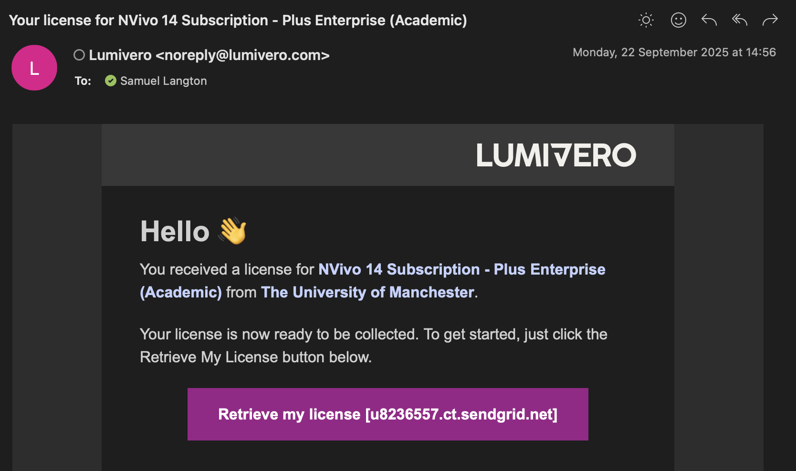{width=80%}

The easiest way to begin the process of accessing NVivo on your own laptop is to click on the licence link in the above email. This will take you to the 'MyLumivero' portal directly. 

IF THE LINK DOES NOT OPEN, you can [access the portal](https://lumivero.com/customer-login/) here and scroll down until you see "MyLumivero Login".

You will then be prompted to log in, so if you don't have an account yet, select **Sign up now** and create your account. This will involve verifying your email address. Make sure you use your university email address (the software licence is linked to that). If you are asked, you can select that you're using NVivo Lumivero solutions for yourself and then agree to the terms and conditions, as demonstrated below.

{width=70%}

Once it's created (or if you already have one), use those login details to log into the Lumivero portal. Here, you can select from a range of software that Lumivero offer. On the left-hand side, you should see NVivo in the **Available products** tab. It's possible that your landing page is already on NVivo, in which case, great!

{width=60%}

Once you select NVivo, or if you're already on that page, you will have the option to download it for your computer. It will look something like the example below (although for you, it might say Windows instead of Mac). Download NVivo! You might need to open the `.exe` (for Windows) or `.dmg` (for Mac) file in your Downloads to begin the install. 

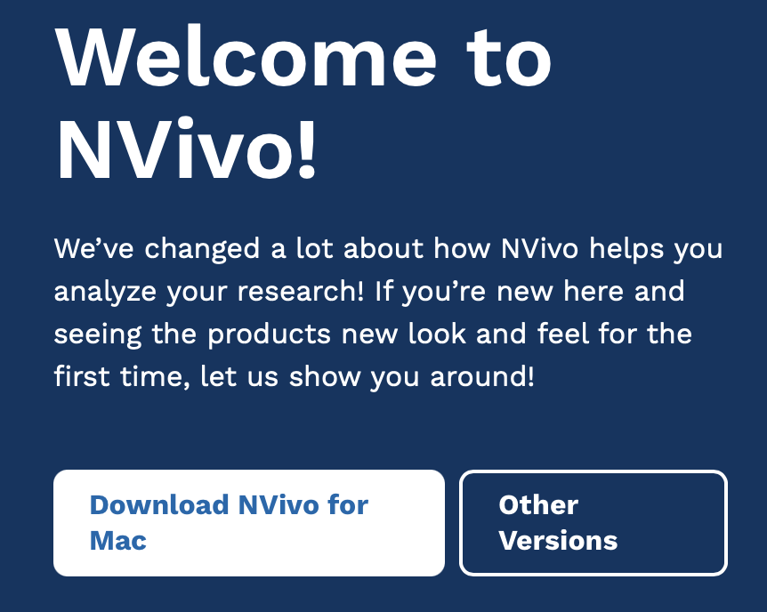{width=70%}

Once it's downloaded, you should be able to open up NVivo. Huzza!

One final thing before we get started: please do not forget to read Chapters 1 and 5 of the ["Using Software in Qualitative Research: A Step-By-Step Guide"](https://www.librarysearch.manchester.ac.uk/permalink/44MAN_INST/bofker/alma992976454286501631) book. These are key for you to fully understand how to use software for qualitative data analysis.

The lab sessions will also be supplemented with video tutorials from the Lumivero website. 

### Activity: Watch NVivo tutorials

Discover more about the NVivo tutorials [here](https://help-nv.qsrinternational.com/20/win/Content/tutorials/nvivo-tutorials.htm). These tutorials use a slightly older version than we are using (usually NVivo12), but the layouts are comparable and principles the same.

Take a look at the website now and watch some of the starter videos, if you'd like. You can choose to watch the Windows or Mac tutorials - whichever suits your needs. If you haven’t watched them already, we would recommend watching the following before you get into the main lab work:

- These tutorials will teach you how to:
    + ‘Import Documents’, for [Windows](https://www.youtube.com/watch?v=QN6AAKmZvIo) or [Mac](https://www.youtube.com/watch?v=I7tJpX2ixDI). 
    + ‘Code Your Data’, for [Windows](https://www.youtube.com/watch?v=vVEyhibQGog) or [Mac](https://www.youtube.com/watch?v=J-EZlNTZDrw).
    + ‘Organise and Review Your Nodes’, for [Windows](https://www.youtube.com/watch?v=KEo3nt5GL7Y&t=2s) or [Mac](https://www.youtube.com/watch?v=p5ugfM6caBE).

- For further details, you may also wish to watch the following short videos:
    + How to ‘Import Documents’, for [Windows](https://www.youtube.com/watch?v=NjTIYXTsYSE) or [Mac](https://www.youtube.com/watch?v=TmkqvFXKwo4).
    + How to 'Code Text' for [Windows](https://www.youtube.com/watch?v=7v59gwQ2LUY) or [Mac](https://www.youtube.com/watch?v=nxYT0J6lbDU).
    + How to ‘Create Memos’, for [Windows](https://www.youtube.com/watch?v=Gks-AtrMLlI) or [Mac](https://www.youtube.com/watch?v=_tSQZBZeAUc).
    + How to ‘Create a Word Cloud’, for [Windows](https://www.youtube.com/watch?v=Rx-8eY_z6lQ) or [Mac](https://www.youtube.com/watch?v=mEVyV19D0fY).
    

    
We’ll be talking you through most of the above in the session notes today.

## What kinds of data can I input into NVivo for analysis?

In brief, and just for your information, you can analyse the following kinds of data in NVivo:

**Text** – NVivo can manage files that are .txt, .rtf, .doc, .docx, and .pdf. It is OK to include embedded charts, tables, graphs, or images. However, in Word files, headers and footers, page numbers, line numbering, and comment boxes (as per MSWord) will not be visible once imported.

**PDF format** - where the file has been converted into PDF from Word or a similar application, the file can be imported as it is, though some functions, like Text search, will not work quite as well as if they were in Word/RTF/plain text. Suppose the PDF document was created (psossibly scanned) without optical character recognition. In that case, it may just be an image style format which can still be imported, but the more limited ‘region selection’ mode, not ‘text’ mode, will be required to apply codes or annotations, and text search tools are unlikely to work.

Today, we'll be doing some importing of documents and PDFs.

**Datasets** – Import, e.g. survey data directly from Excel and other database formats.

**Multimedia** – NVivo recognizes many formats for visual, audio, and audio-visual materials. For video files, the general rule of thumb is that if they play in Windows Media Player, they will work in NVivo.

**Social media data** - Information from social media, such as Facebook, LinkedIn, and Evernotes, can be imported into NVivo. We'll be taking a look at that next week.

**Ncapture** – This is an interface between Internet Explorer and NVivo which can be used to capture web pages, pre-code them and then import them into a project.

### Activity: Find some data…

Before starting with NVivo, we’d like you to find some data you’ll use in the session today. You can use the data that we use, which are available on Convas under the **data for lab and homework tasks** in week 6 (look for **Dankse bank data**). That said, we think it’s more interesting for you (and will help you remember the processes better!) if you find some data that reflects your own criminological interests. Feel free to follow our steps below, and then repeat them for your own data sources, if you'd like. It's also fine if you just want to use the data we use.

For our data, we collected five news stories from different news organisations for the search ‘money laundering Danske Bank’. If you don't know about this scandal, have a [quick read](https://en.wikipedia.org/wiki/Danske_Bank_money_laundering_scandal) about it.

Remember, if you want to use your own data, please go ahead. Otherwise, download our pre-existing data from Canvas.

When we first downloaded our news articles, we saved each news article in a folder on our laptop:

Note that these news articles have been saved at a webpage (e.g., webarchive or html). If you're downloading your own data, it’s important to then save your web content as PDF files. This will make it easier to import them into *NVivo* (we’ll get to this later.) If you’re on a Mac, you can open the web page, select print, and then select ‘Save as PDF’. Save these in your Media Articles folder. You can "Save as" a PDF in different ways, so stick with what you know.

 

If you are using a PC, these are the steps you need to take to download a news article as a PDF:

If you're using your own data, do this for each of your media articles. **If you're just using the data we gave you on Canvas about Danske, we already did this step for you** (i.e., the news articles are already PDFs).

We can then search for government reports and documents on money laundering strategies within the EU. We saved five of these to our documents folder, also as PDFs. You can do the same for your own topic too.

We then searched for ‘money laundering criminology’ on [Google Scholar](https://scholar.google.com/) – you could also try the [University’s online databases](https://www.librarysearch.manchester.ac.uk/) (probably a more systematic approach in actual fact) – and selected five relevant academic articles published since 2015. Again, we saved them as PDFs.

In order to keep it nice and tidy, we’ve organised our n15 documents into three folders: **‘Media Articles’**, **‘EU Strategy'** and **‘Journal Articles’** (five in each). In each of these three folders are our PDF files. In total, these comprise our qualitative data. If you've downloaded our data from Canvas for this exercise, try and use the same folder structure.
 

If you've decided to use your own data on a different topic, consider placing all your PDFs with an equivalent clear folder structure for clarity (e.g., media articles, government strate, or whatever your data corresponds to). 

This is just an example dataset; in a real research project, your literature and data search would need to be much more extensive and systematic. But for the purposes of demonstrating NVivo, this will suffice!

Now we have our PDFs organised into folders, they are now ready to ‘import’ into NVivo. We’ll get to this stage soon. For now, let's introduce you to NVivo more generally.

## Creating your NVivo project

Before we open up our textual data in NVivo, we will need to learn how to create a new project.

### Activity: Getting Started with NVivo

Let’s get started then. First, you’ll need to open NVivo from your cluster PC or laptop. When you first start NVivo on Windows, you will be asked to create a user profile (see below). The equivalent might happen on Mac.

{width=70%}

You can just click OK using the default settings.

NVivo will then open. It will look something like the screenshot below (on Mac).

{width=70%}

Or if you're using Windows on a computer cluster PC, it might look like this:

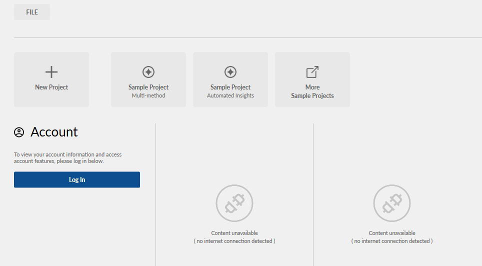{width=70%}

If you're asked to install an update, you don't need to.

Second, you need to create a new project. So click on the appropriate option - "Create new project"/ "Blank project" / "New Project". You’ll then need to name and save the project; Make sure to save it in the same folder as your data. Here's just an example of what my interface looked like.

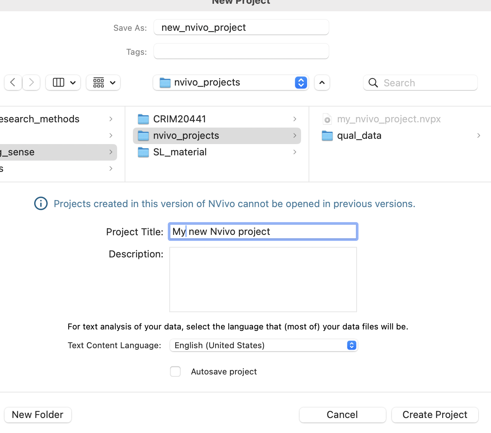{width=70%}

Click ‘Create’/'Create Project' on Mac. On Windows, click 'Next' and then 'Create Project'. And we are ready to start our project!

You will then be given a quick tour of NVivo -- we recommend taking a look at this (i.e., don't click _skip_!) to familiarise yourself with the basic functionality.

The useful thing about Nvivo projects is that every thing you do, such as taking notes, loading in data and creating visualisations, is saved within one workspace. Just make sure that you are saving regularly by clicking on 'File' and then 'Save', and make sure you save before closing Nvivo on your computer.

So, what can you see in the interface?

## Understanding the NVivo interface

At the top of the screen are the ‘ribbon tabs’. In Mac:

 
Ribbon tabs provide access to varying functions.

Basic ribbon tabs consist of:

- **File**: Saving, Managing etc.
- **Home**: editing functions etc.
- **Create**: making new things like annotations and coding.
- **Import**: various import options,
- **Explore**: range of options like text searches, word frequency counts, and diagrams. 
- On Mac you might also see **Layout** and **View**. Feel free to explore these but we won't use them today anyway (so Windows users, do not worry).

**Note**: There are a few aspects of work that are only accessible via the ribbon tabs (for instance, some of the editing tools are only accessible from the *Home* Tab. However, many other functions are accessible more easily from the left-hand navigation pane (e.g., you will see that **Explore** appears there, in addition to the ribbon). Also, note that some ribbon tabs only open up when you open up some new option or diagram. We mention this now in case you wonder why some ribbon tabs appear and disappear! You’ll figure this out through trial and error as we go on.

So, below is a summary of the main Nvivo interface (on Mac). It will look comparable on Windows but put your hand up if you encounter any issues.

<!-- You organise all your research materials in the **‘Navigation View’**. The navigation pane (left-hand portion of the screen) is the main way of moving around the main functional areas of the software. To get into the right folder, you need to see the relevant ‘list’ so that you can open individual items. When you select a function, a set of folders will appear in the top half of the pane. Select a folder, and the relevant list will appear on the right. Double-click on an item in the list, and the relevant item will open up in the Detail pane below. Successive opened items are tabbed along the central bar, separating the List pane from the Detail pane. -->

## Navigation View

Today, you’ll learn about three of the sections in the Navigation View: *Data*, *Codes* (sometimes called *Nodes*) and *Memos*. 

The layout varies slightly between the Mac and Windows software and also between different versions of NVivo (e.g., NVivo 12, NVivo 15). So keep this in mind when following the below instructions. In almost every scenario, the equivalent functionality exists between different versions and operating systems -- it sometimes just takes a bit of lateral thinking and trail-and-error to get what you need! 

### Data

*Data* can be any data file or memo, embedded or external to the project.

Data can be text, multimedia and datasets. There are three main folders associated with data. For now, we’ll focus on the *‘Files’* folder.

### The ‘Files’ section

The *Files* folder is designed to hold all ready-made data (to be ‘imported’), such as PDFs of text, that you wish to work with directly within NVivo.

### Activity: Folders

Have a go at creating folders to house your data in the Files section. In a project consisting of different types of data, we’d usually recommend that folders could be based on the type of data. This choice will vary depending on the complexity and variety of types of data. If you only have **interview** data, for instance, you might just create a folder called ‘Interviews’. You can decide to organise your folders in a way that suits your own thinking style.

*Tip*: Keep the folder structure simple - although you can scope and filter later queries by folder - folders cannot reflect all the different features of your data. The assigning of attributes (via node classifications) will eventually reflect things like socio-demographic information about your data/respondents/cases, etc. You’ll need to think about this more if you decide to use NVivo at some point in your research, but don’t worry about these complexities just now!

So, right-click at the top level (e.g. Files) -> New Folder – provide a name for your folder:

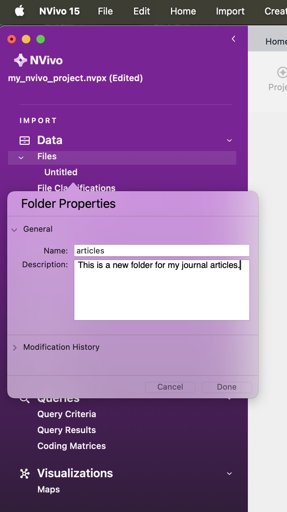{width=70%}

You can name your folder whatever you want. Here, I've named ours 'articles' and provided a description to remind what the folder is for in the future. 

Then click ‘Done’ (or 'OK'). You can then create a second and third folder for your other files. In my example, given the Dankse bank data (see above), I name my other two folders 'eu strategy' and 'media articles', respectively. You can rename your folders at any time by right-clicking on them and clicking 'Get Info' (on Mac) or 'Folder Properties' (on Windows). This brings up the folder properties window, and you can then rename the folder. In this example, I rename my 'articles' folder to 'academic articles' for clarity. 

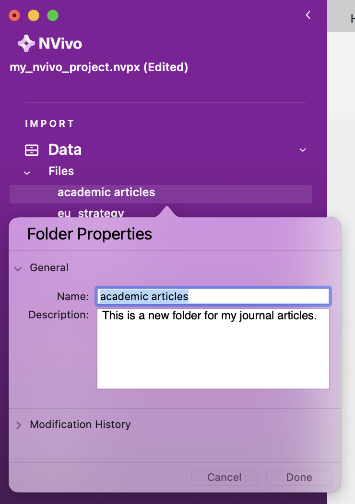{width=70%}

We’re now beginning to organise where our documents will go. Your **Files** summary under for **Navigation View** should now look something like this i.e., three folders ready to organise our data.

{width=90%}

## Importing Data

Now, we have folders where we can import our data.

There are different things enabled during the import of data. For now, for straightforward data importation, whether it is text, PDF, or the full range of audio-visual data, you can follow essentially the same process. You just have to be careful to tell the software what type of data you are looking for (e.g., ‘document’, ‘PDF’, ‘NCapture’, etc.).

Remember that ‘data’ and Files in NVivo are any material at all that will help you to integrate all the information that feeds into your project.

### Activity: Import data

For now, let’s just import your data. First, make sure the Files folder where you want to import your documents in the Navigation View is highlighted. For instance, we’ll start by importing the PDFs of our media articles, so single-left-click the ‘media articles’ folder to highlight it.
 
You should now be viewing a series of options below your ribbon (see below for Mac). One of these will be 'Import' under which you can select 'Files' and then 'PDFs'. On Windows, you don't need to select PDF as the file type -- it will just take you to the folder.

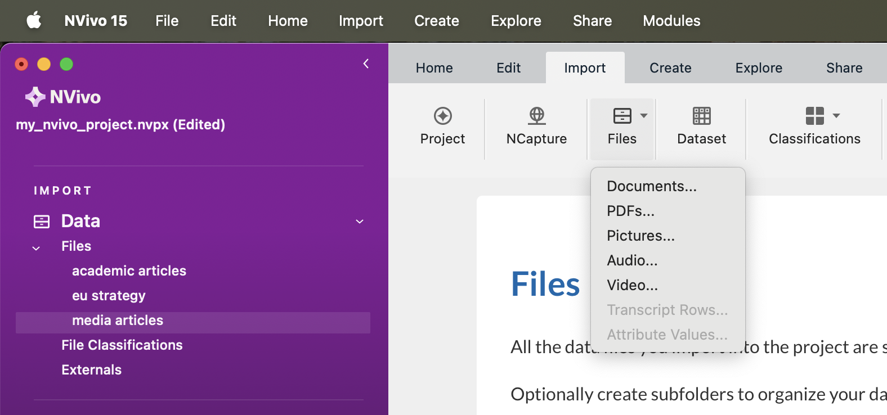
 
This will bring up your computer’s file search folder. Mine looks like the view below. Locate the folder where you saved your media articles and select the first one to import. Double-click or select it and click "Import". On Windows, you select the file using 'Open' and then click 'Import'.

Once imported, you’ll then need to name this document. I’ve called my first media article ‘New York Times article’. Do this is for your own article, naming it something sensible, and then click ‘Done’ (or 'OK').

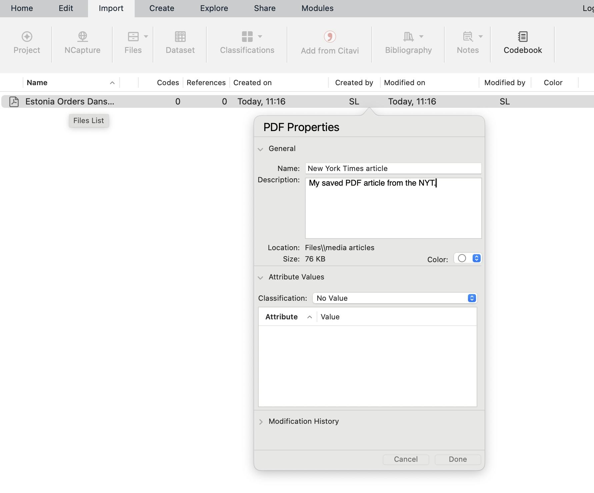
 
Your first article will now be imported. You’ll see it appears in your List View, and the contents of the article can be seen in the Detail View.

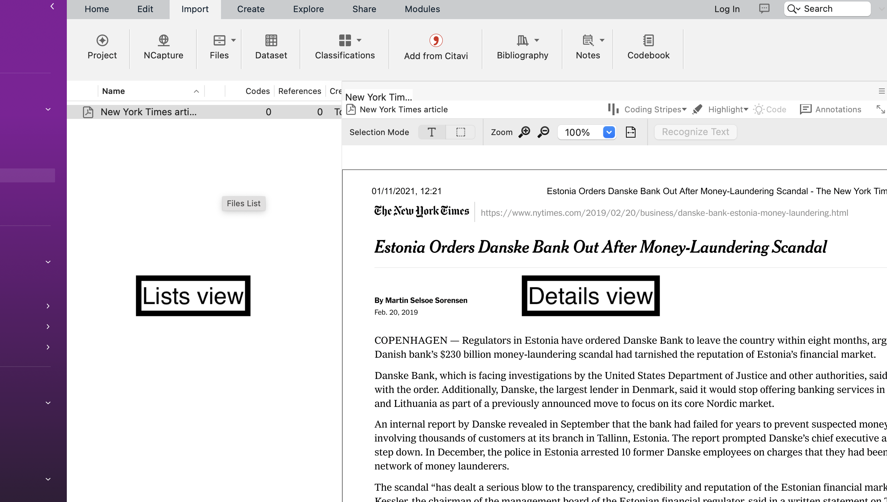

You now need to repeat this process for all your media articles, journal articles, and other literature. You’ll then have 15 documents imported into NVivo. In doing so, you can select multiple files at once to import by holding down Command/Ctrl/Shift(Mac) or Ctrl + A(Windows) when selecting them. If you do this, ensure that you have the correct folder selected (e.g., media articles) and that you only select files belong in that folder (e.g., media articles!). You won't get the option to rename each one, but you can do this later on.

The key point to note here is that we can integrate different sources of data (e.g., media articles, academic literature, official reports) into one place to manage them together. You can even use *NVivo* to undertake your literature reviews in preparation for essay writing – we’ll look at this next week.

When you import documents, they can sometimes look a bit messy. With Word documents and other editable data (not PDFs!), you can make changes to the document so it is easier to follow. If the document is editable, you can click ‘edit’ within the Details window. Keep this in mind for the future.

**Note 5**: *Edit mode/Read only mode* - as above, note that it is possible to make changes to textual documents once you’ve imported them, but unless you change the default option, your files by default will be in protected *"Read-only"* format when on display in the Detail View.

Everything is now neat and tidy!

If you wish to close documents, you need to do this in the bottom left-hand corner by clicking the small cross in the corner of the document you wish to close:

{width=70%}

So, we now have all our documents in NVivo. What next? We need to think about why we are going to analyse these documents. To do this, let’s use the ‘Memos’ folder that appears under the ‘Notes’ section on the left-hand side.

{width=70%}

## Memos

The *Memo* folder allows you to create any number of new documents as locations to write notes and keep track of your analysis. If the new documents are created within or moved into the memo folder, the software sees them as memos, and each memo can be linked to one document or node (we’ll explain this in due course).

Material inside any of the above sources can be classified, coded, linked, and annotated according to the needs of the researcher. We’ll do this mostly next week…

Memos are related to planning, tracking processes and thinking ‘out loud’ about what is going on in your data. With that in mind, let’s create a framework of memos. You can create folders to organize different aspects of note-making. Or you can have the one predefined folder, Memos, but within it, name your memos carefully with standard prefixes which tell you and others what type of memo it is  (e.g., “PROCESS-…”, “THEORY…”).

You can create folders by right-clicking and selecting 'New Folder'. 

{width=70%}

Name your folders as you see fit, but here we've named ours as 'research questions' and 'theoretical framework'. You might rename or create new folders as you go, and that's totally fine.

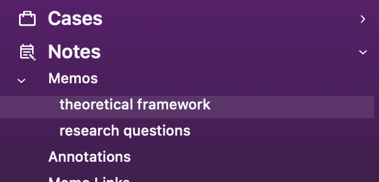{width=70%}

You can then create memos within your chosen memo folder by using the **Create** ribbon tab at the top, and clicking on **Memo**. This will look something like the screenshot below, noting that we've called our new memo "RQs". 

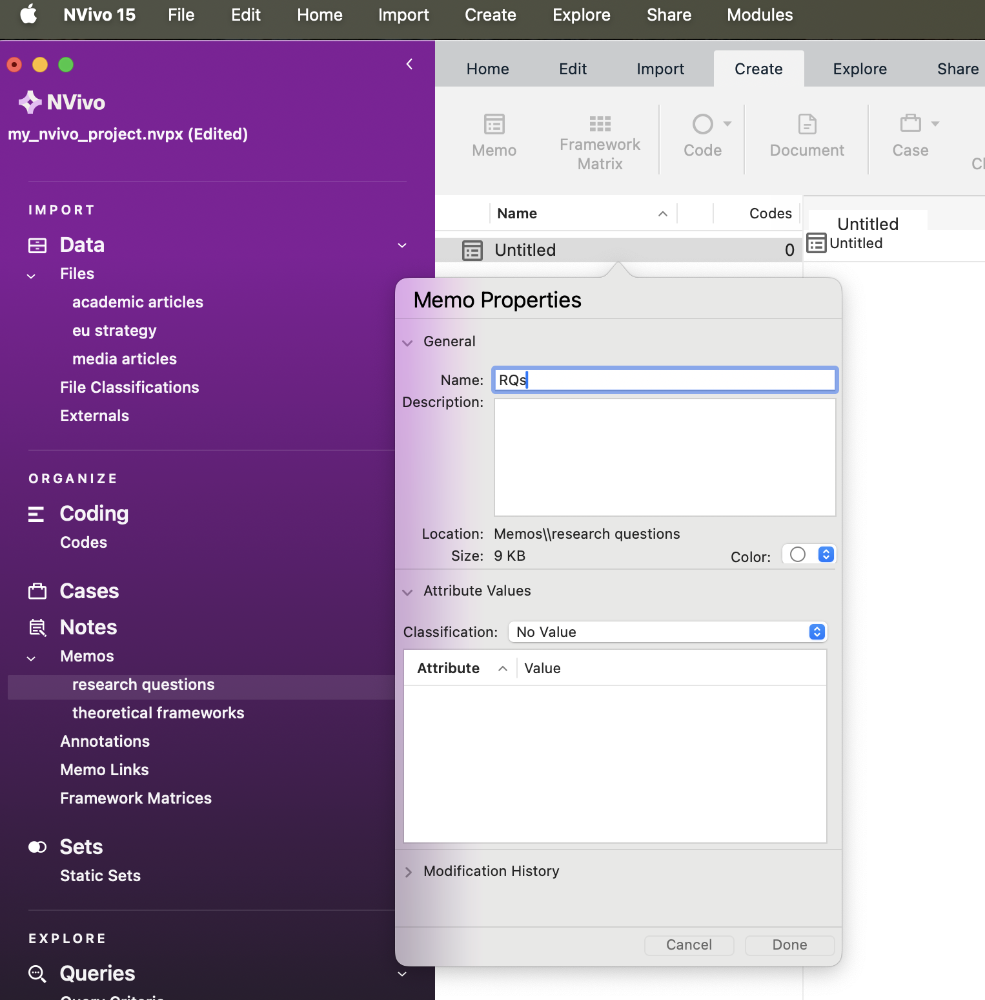

<!-- along the tab/choose the memo icon - or alternatively, as usual – you can select the correct folder and then right-click in the List pane to create the new memo. We find right-clicking is always the most straightforward way. The new memo opens up in Edit mode so that you can begin work on it. If the memo closes, double-click on the memo in the list; it will re-open but you will have to ‘click to edit’ in order to write in it. So let’s try this. -->

### Activity: Memos

See if you can follow what we’ve done for your own data.

We’ve created two folders: ‘research questions’ and ‘theoretical framework’ (well, that's what I did! Maybe you named them something else, which is totally fine).

We’ve highlighted the research questions folder, created a new memo called ‘RQs’. We then clicked on the Detail View and started making notes on our research questions.

But more realistically and seriously, as you can see, in our first research question, we are interested in analysing how the media represented Danske Bank after news of the money laundering scandal emerged.

In the second question, we aim to analyse how media construction differs from academic discourse and EU strategy discourse, if at all.

Remember that we also created a second memo for a theoretical framework. In here, we’ve made notes on which criminological theories we might use to inform our analysis. For instance, we’ve made notes about [rational choice theory](https://en.wikipedia.org/wiki/Rational_choice_theory_(criminology)) and [routine activities theory](https://en.wikipedia.org/wiki/Routine_activity_theory). These theories can guide our analysis and we can refer to them periodically while working within Nvivo. You can create such a memo and make some notes now if you'd like (but this is optional -- if you're so excited to try more things in NVivo that you just *cannot wait*, then feel free to carry on).

When we analyse our data (we’ll do this properly next week), we can begin to integrate our different data sources together and organise the data around key themes and codes. Coding our data is by far the most important step!!! Coding schemes and coded retrieval are key tools of qualitative analysis. To do this in NVivo, we use ‘Codes’ (often used interchangeably with the name 'Nodes'). We’ll do this in much more depth soon. For now, we’re going to learn to do a basic analysis of our textual data.

## Word Frequency

Finding ways to give others insight into your qualitative data can be challenging. You often end up with pages of response text, which would quickly overwhelm readers. However, considering word frequency is a great option for instant accessibility to this qualitative data.

'Word clouds', a visualisation of word frequency, can add clarity during text analysis in order to effectively communicate your data results. Word clouds can also reveal patterns in your responses that may guide future analysis. You can read more about Word clouds [here](https://boostlabs.com/blog/what-are-word-clouds-value-simple-visualizations/).

### Activity 8: Word frequency

You’re now going to analyse your imported documents by the frequency with which words appear in them. To do this, click on 'Explore' in the your ribbon tab, and then 'Word frequency'. 

Once a new window opens in the Details View, the first thing you need to do is select which file (or files) we want to run the word frequency count on. We can do this for individual files using 'Selected Items' or for every file in a folder using 'Items in Selected Folders' (on Windows: 'Selected Folders...').

You can choose whatever you'd like, but here, I choose 'Items in Selected Folders', so that I analyse multiple files at once, then select the media articles folder. This means that I will be creating the frequency count based on every file in that folder!

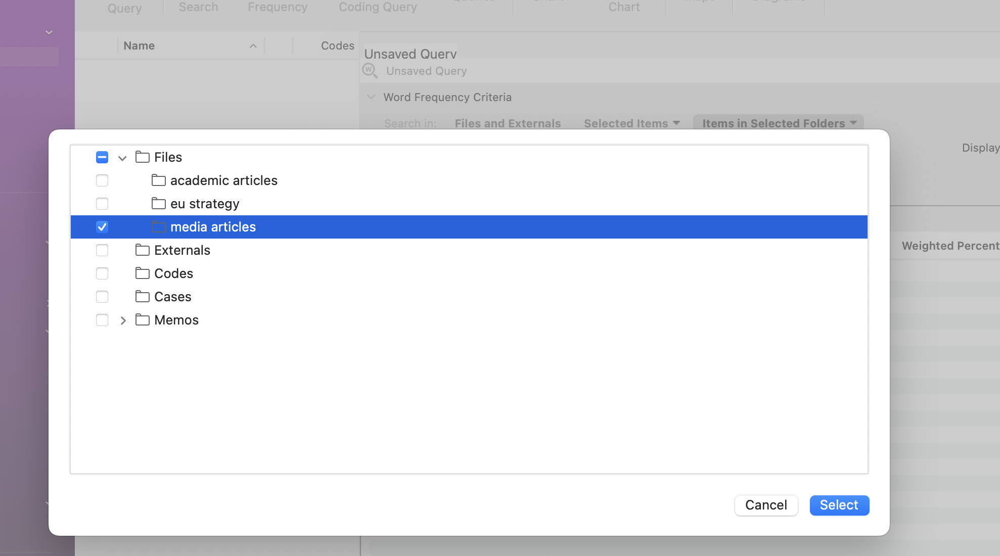

This will open up the 'Unnamed Query' (or 'Word Frequency Query Results') panel in the Detail View. At this point, simply ensure all the default settings are selected and click ‘Run Query’.

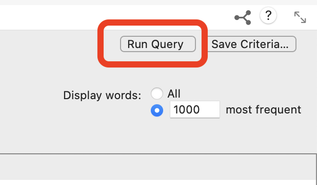
 
This will produce a list of all the words in all your documents and order them according to ‘Count’, i.e. the word with the most hits appears at the top.
 
This is not great to look at, so what we can do is create a ‘Word Cloud’. Simply choose the ‘Word Cloud’ option at the top of the Detail View (or on the rigth hand side for Windows), and this translates your query into a neat visualisation of the word frequencies:

 
We can then save this image as a picture. Right-click anywhere in the Detail View, and you’ll have an option to ‘Export’ (or 'Export Word Cloud' on Windows). Select this, choose a suitable folder location, and an appropriate file format (e.g., JPEG) and name, and click OK/Save. Your Word Cloud is then saved as a picture. You could then insert this into any of the essays or reports as an example of a superficial but indicative insight into the content of your documents.
 
That said, considering all our documents were identified in relation to ‘money laundering’, it was pretty obvious that ‘money laundering’ would be the main term, isn’t it?! In other words, the findings here are an artefact of my data search at the start.

How about we remove 'laundering’ from our word frequency query? To do this, you can go back to the summary tab showing your list of words and their respective counts, right-click on the word you want to exclude, and then choose ‘Add to Stop Words List’. Obviously, if you want to add 'laundering' to the stop list, ensure that that's the word selected.

If you like the new Word Cloud better, you can then ‘Save Query’ and give it an appropriate title, and it will save in your project.

What does this tell us? Well, to be clear, this is a crude analysis. But it does throw up some interesting keywords, such as place names (e.g., 'copenhagen'), potential descriptions of people or companies (e.g., 'estonian'), dates (e.g., 2013).

We can use these words to direct our coding of the data (or not). We’ll look at this more next week.

### Activity 9: Create two distinct word clouds

This is pretty cool, isn't it? But we can even go one step further and ask ourselves: will the word cloud our 'academic articles' be similar to that of 'media articles'? Do they use remarkably different terms when they discuss this issue?

To do that, we first need to select the subset of PDF documents we are interested in analysing. We can do this using the steps above. Assuming you've already made your word cloud for the media articles using the steps above, do the same again, but this time select the journal articles folder. Create the word cloud, then save it using the steps above.

Now you have the one we've already made for media articles:

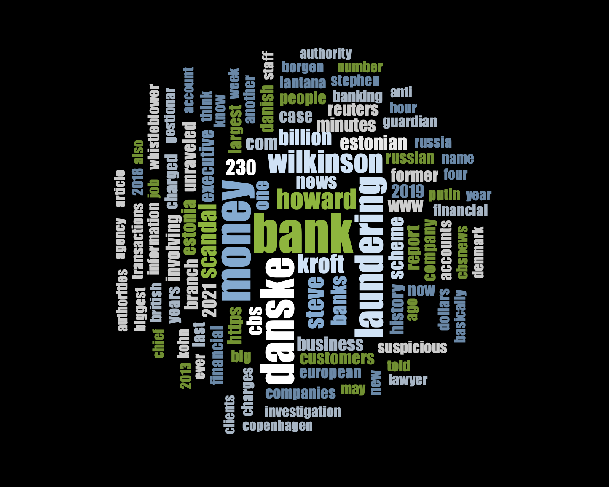

And a new one for the academic articles:

They look quite different, don't they? Interesting! Have a chat in small groups to discuss why you think these two word clouds are so different from one another.

If you obtained slightly different word clouds, it may be because we had previously added the word "laundering" (or something else) to the "Stop words list", or perhaps we are using slightly different files. This totally fine -- the important thing is that you understand the steps and create some word clouds using one or more files.

## Summary

You now know how to create a project in NVivo, import relevant documents, organise them into folders, tidy them up, create memos to structure your thinking and undertake a basic analysis of your documents using frequencies (in the form of a word cloud).

These are all fundamentals of using NVivo. Of course, there are lots of tabs, functions and areas we haven’t explored, and won’t explore. These are much more advanced tools, but what you've learnt today is a good foundation. Next week, we’ll build on these basics and put our minds to work on developing conceptual frameworks through coding our data – this is where the systematic analysis begins…

