# Week 7 {#week7}

## Learning outcomes

In this session, you’ll learn the following:

- How to interrogate qualitative data using NVivo. 
- How to build theory through *deductive*, *inductive* and *abductive* strategising. 
- Some useful analysis features in NVivo, including how to work with non-textual data.

## Deduction, induction, abduction – key analytical strategies for qualitative data

To recap from the lecture video, this diagram gives some indication as to the directions of data analysis:

 
Hopefully you will now understand strategies for approaching research, including data collection and data analysis.

**Induction** is considered to be ‘bottom-up’ where we start with very broad general interests but build theory and concepts by first coding and interrogating the data. The key here is to ensure existing theoretical perspectives and concepts do not over-define our analysis and thus obscure the possibility of identifying and developing new concepts and theories.

**Deduction** is considered to be ‘top-down’ reasoning where we have predetermined ideas and theories and seek to test or evidence these. The coding categories we use are, therefore, explicit in directing the focus of our analysis.

**Abduction** integrates these two approaches, giving flexibility across the analytical process and ensuring interplay between our ideas and data.

In this session, you’ll learn to interrogate your qualitative data using NVivo from all perspectives. You can read more about these strategies here.

## ‘Coding’ qualitative data using ‘nodes’

> 'A code in qualitative inquiry is most often a word or short phrase that symbolically assigns a summative, salient, essence-capturing, and/or evocative attribute for a portion of language-based or visual data.’

 - Saldaña (2016) [*The Coding Manual*](https://uk.sagepub.com/en-gb/eur/the-coding-manual-for-qualitative-researchers/book273583) (p. 3)

You can find copies of Saldaña’s *The Coding Manual* in the [University Library](https://www.librarysearch.manchester.ac.uk/permalink/44MAN_INST/1r887gn/alma992975869959501631).

*‘Coding’*, *‘coding schemes’* and *‘coded retrieval’* of our data are key tools of qualitative analysis. The terminology and philosophies that underpin coding processes are explained below (but also in the lecture videos), and we find that specific methodologies use particular routines when coding. For instance, one common approach is informed by the ‘Grounded Theory’, which involves both the induction and deduction approaches to coding data. 

Here, researchers would undertake a first layer of ‘coding’, often called [‘open coding’](https://en.wikipedia.org/wiki/Open_coding), to break down data into indicative themes and concepts. This precedes more granular coding, called [‘axial coding’](https://en.wikipedia.org/wiki/Axial_coding), where categories and concepts are refined further. We’ll draw on this approach in today’s session. The structures of coding schemes, alternate groupings and basic retrieval mechanisms are key to moving forward with analysis.

In NVivo, we code our data using ‘nodes’. This is sometimes also termed the ‘indexing’ of our data.

**Note 1**: If you only take one thing away from today’s session, then it should be the importance of nodes. These are the fundamental building blocks of the theories and concepts we interpret in our data.

So, let’s learn how to code using ‘nodes’.

### What are ‘Nodes’?

Node is a term that refers to a point in the NVivo database, but a code label may be the name you give the node. Codes or nodes can be your ideas about the data – they can be generated inductively, deductively or abductively and may be refined, changed, grouped or deleted at any time. Applying nodes, etc., to passages of source data, at a minimum, provides the basic code and retrieves actions needed to accumulate together all the bits of data linked by common threads and themes.

Nodes **can be containers** within which we locate our data related to particular themes or ideas of interest. We can use them in this way to organise our thinking. For instance, if we were looking at the Danske Bank data from last week, we might have created nodes such as: ‘methods’, ‘ethics’ or ‘perceptions’ of corporate money laundering. Within each of these ‘nodes’ we could copy key sections from our media articles, journal articles and policy documents into them to collect data about key themes. Nodes act as containers for or links to data exemplars based on conceptual ideas, themes, codes or more structurally for people, contexts, places, etc. The terms nodes, codes, keywords, and themes are used similarly, so **please note that we often use the terms nodes and nodes interchangeably**.

Nodes **can also be empty** – for example, they can act like hierarchical top-level codes with nodes underneath them that do contain or have been applied to data. So, we might have created a top-level node entitled ‘money laundering’ and then sub-level nodes entitled ‘methods’, ‘ethics’ and ‘perceptions’. We might even create further layers of nodes within each sub-level, e.g. in the ‘perceptions’ node, we might break that down further to ‘perceptions of the public’, ‘perceptions of enforcement authorities’, ‘perception of politicians’, and so on. These sub-nodes can also be empty in the sense that we might be interested in something specific conceptually (like 'perception of politicians') but actually not find anything, even if we do have information for another perception label.

These node layers, therefore, build a structural framework for our data. By organising our raw qualitative data (i.e., the news articles, the journal papers) according to these nodes, we can make sense of what would otherwise be an overwhelming amount of information. Plus, each node of any sort can be linked directly to one memo – so that relevant analytic notes are easily accessible from the node itself.

Let’s do this then. Here, we’ll focus on using nodes for reflective purposes and thematic purposes.

### Activity 1: Coding

We need to start by importing our data. Start by opening NVivo and creating a new project – call it something relevant for today’s session, e.g. Lab Session Week 7.

You’ll find two datasets on Canvas in the Week 7 learning materials section: **1. Dataset 1 Probation Interviews** and **2. Dataset 2 GMP Twitter data**.

You’ll need to download and save these to your One Drive or personal computer. Dataset 1 is a zip file, you’ll need to [unzip it](https://support.microsoft.com/en-us/windows/zip-and-unzip-files-f6dde0a7-0fec-8294-e1d3-703ed85e7ebc) (this might be done automatically on Mac). 

Once you’ve done this, return to *NVivo* and import them using the knowledge you gained last week. For instance, first, create folders within your Files section to house the data (see below). Second, import your data. If you import all the interviews simultaneously, there is a small chance your computer will explode, catch fire, and burn the lab down. But let’s hope not. Be patient; importing so much data at once can take a few minutes. 

If it does crash, you should import the transcripts in smaller numbers. Or, import a few of them to get a feel for the process rather than importing the full lot. You can see what we’ve done in the screenshot below for the probation interviews:

 
If you double-click on any of the transcripts in the **List Pane**, you can see the content in the **Detail Pane**.

For Mac users, when you import the *GMP Twitter Data*, you can import it as a ‘Dataset’ rather than as ‘Documents’. You’ll first encounter the screen below:

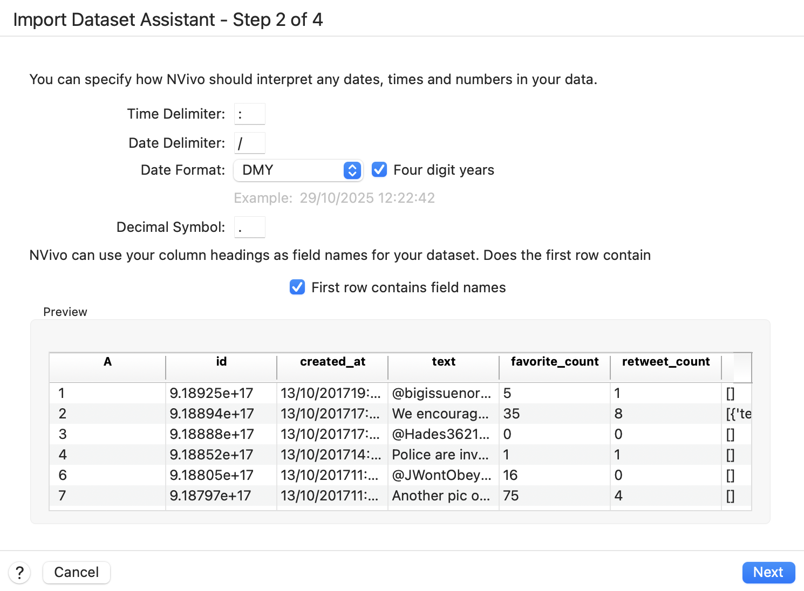
 
Simply click ‘Next’, then ‘Next’ again in the following window and then ‘Import’. You’ll then be able to see the Twitter data in the Detail View, as below:

 
For Windows users to import data from an Excel file, go to Import, then Survey and then Excel.

 
You will have to click through the Survey Import Wizard, which looks something like this:

 
There are five steps to click through where you check to ensure the data will be imported correctly. In this case, you can click ok through each step until step 5 without making any changes. **In "Step 5", unclick the autocoding themes and sentiments options**. It may take a few minutes for NVivo to process the request.

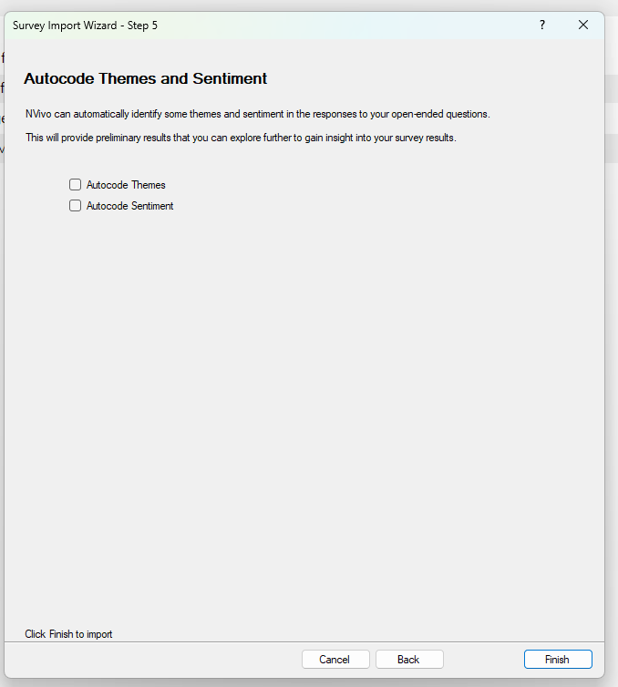
 
This should be the more or less be the result when you finish with the import wizard:

 
Ok. So now we have both our datasets imported into NVivo. It’s probably worth saving your project in case something goes wrong.

Usually, as these two datasets are very separate in terms of purpose, we would probably create two separate projects in NVivo to keep our separate research projects apart. For the purposes of getting to know the software, though, we can analyse both in one project today. You will, however, notice from the screenshots above that we have at least placed our datasets into two folders within the same project in an effort to keep things organised.

## Using ‘mind maps’ to organise your ‘analytical process and framework’

At this point, we need to give our coding some focus. To do this, we can use **‘mind maps’** so we know how to code our data. To demonstrate this, we will code the interview data in *Dataset 1* using a deductive approach and then code the Twitter data in *Dataset 2* using an inductive approach.

### Activity 2: Deductive coding

First, navigate to the 'Maps' tool. You can access maps via the Navigation Pane on the left if you want. Another (maybe easier) way is to navigate to the 'Explore' tab in your ribbon, and then selecting 'Mind Map'. It's possible that you need to search around for these - have a look and if you can't find it, stick up your hand and we can help you.

You can then name it. Call it "Deductive Approach to Probation Interview Data". You should end up with something like the following:

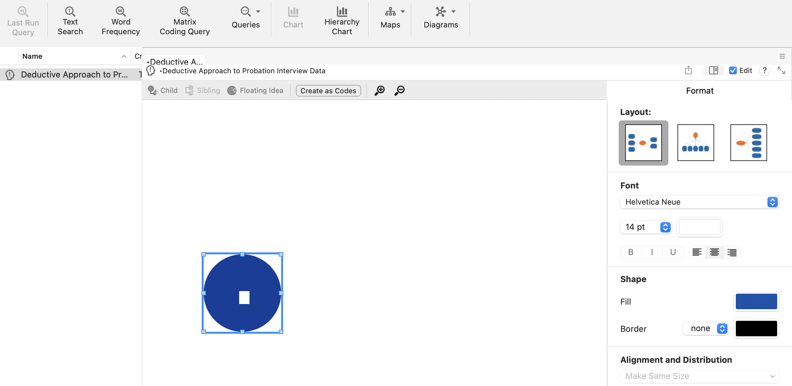
 
Now, *deductive logic* assumes that we have a predetermined set of codes, ideas and themes that we want to understand better. For instance, the interviews that were carried out with **Chief Probation Officers (CPOs)** in this research had the following clear research objectives:

*1.	to investigate the social and educational backgrounds and career histories of CPOs;*
*2.	to explore their perceptions of community penalties, developments in these throughout their careers and potential changes in the future;*
*3.	to examine the role of CPOs as managers and their relationships with central government, local agencies and their probation committees.* 

So, we can extrapolate key ideas from these objectives and use them to guide the data's coding. We’ve divided the research objectives into key concepts and organised this in our mind map. Look at our screenshot below and see if you can replicate our work. You might pick a different structure or codes; that’s fine, too! Play around with creating *‘children’*, *‘siblings’* and *‘floating ideas’*. **Children** branch away from your central concept (below, CPO interviews in the blue circle), and **siblings** can be created as additional branches. You can just keep clicking to create new siblings, get the structure you want, and delete old ones whenever you'd like.

Play around with colours and structure, too. Don't be afraid to click around to try things out: this is a useful skill in itself and a powerful way of learning. Be confident to try things out and make mistakes!

If you want, you can learn a bit more about creating and editing mind maps in [this YouTube video](https://www.youtube.com/watch?v=gyjM1IW4LQI). Note that although the video is for an older version of Nvivo (specifically, Nvivo12), the concepts and ideas are exactly the same.

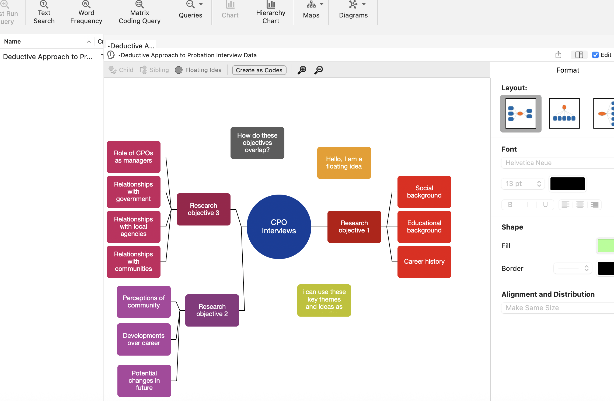
 
What we’ve done here is create a predetermined framework for coding the interview data. When we read the transcripts, we can assign these themes to what was said in the interviews. One way in which this helps us, is that we read the transcripts with a purpose (i.e., looking for our themes) and then we can use NVivo to code bits of text according to these themes.

Plus, to save us from having to create all the nodes individually, we can now use the **‘Create as nodes/codes’** option. This should only be used after you have finished writing all the themes from the picture above! Click it, then choose ‘Codes’ (in some versions this could be 'Nodes' but as we mentioned earlier, codes and nodes are often used interchangeably).

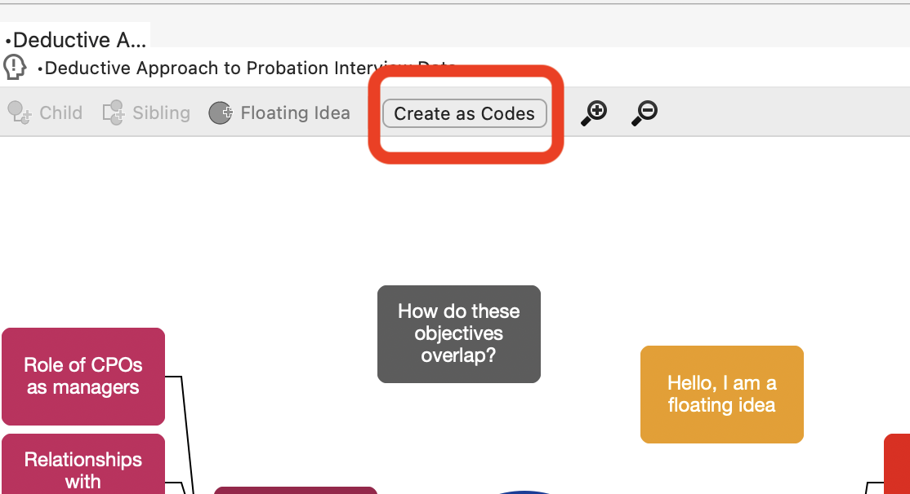

Now click on ‘Codes’ in the Navigation Pane on the left, and you’ll see something like the following. Open up the folders so you can see all the nodes!

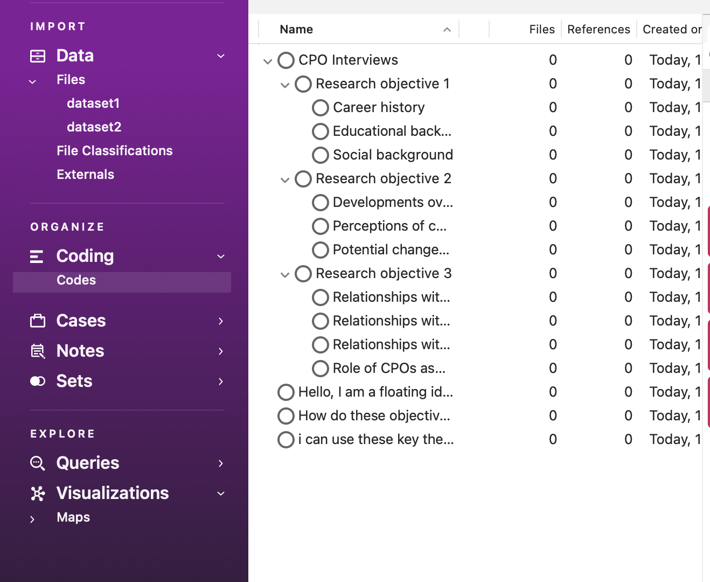
 
This is where the hard work begins. We now have to code our interview data according to these themes.

There are multiple ways to code data according to nodes you have already created. You can also use some of these methods to select more than one code to apply to the selected passage of data.

The easiest way to do this is as follows (though *NVivo* gives you many ways to code the data). First, go back to your Files, click on the Dataset 1 folder, and double-click on Interview 1 (int01). This will open the transcript in the *Detail Pane*. For ease, now click on ‘Codes’ so you can see all your created codes and have them in mind when you read the transcript. You also refer back to your mind map at any time to help get your thinking in order. Now start reading the transcript; each time you read something corresponding with your themes (i.e., codes, nodes), you need to ‘code’ it.

To do this, simply highlight the text and right-click (for Mac, Control + click), choose *‘code selection’* and then *‘to existing nodes or cases’*. Below, we've done this to highlight something about the CPOs degree choice, so we've coded this in relation to educational background (makes sense, right?).

 
For Windows users, this might look slightly different. You have to click on *“Code”*, then a new window pops up with the nodes, and you select from there. The right-click menu to code selected text looks like this (for a different example of text):

 
You’ll notice the passage we’ve selected above relates to ‘career histories’, so we will code this sentence in the corresponding node. However, we also think it relates to ‘educational background’, so we are coding this sentence in two ‘nodes’!
 
In Windows, to select multiple codes, you might have to hit “Ctrl” and then click the additional node you want. In Mac, you do this using a tick box.

 
Keep reading through the transcript and coding segments at single or multiple nodes as you see fit. You’re now coding your data deductively using a predetermined conceptual/thematic framework. Exciting!

Keep coding until you feel like you fully understand how this works and until you’ve coded some data for each of the predetermined ‘nodes’.

There is an option for “recent codes” that shows what nodes you have been using, and this can be slightly easier than opening the window back up, but it depends on how you wish to code the data. Perhaps also code text from other interviews. 

**You don’t have to read all the transcripts**! We're not that mean... Just read enough and play around with coding to understand the process and be comfortable with the software. Remember, if you encounter any issues when trying out coding, or do not understand anything, stick your hand up and we will come and help you (or if you're doing this at home, come to our office hours!).

But where has all our coding gone? The best way to visualise what we’ve done is to go to the ribbon tab at the top, choose ‘view’, then ‘coding stripes’, then ‘nodes recently coding’. On Mac, these options look like this, and on Windows it will be pretty similar (you might find it under 'Document' though).
 

It will then look something like this.

You can also look at what you've coded according to each theme (generated from our mind map) by exploring the Codes option in the Navigation Pane. Here, we can see the number of things we've coded, and then view them by clicking on each coding theme.

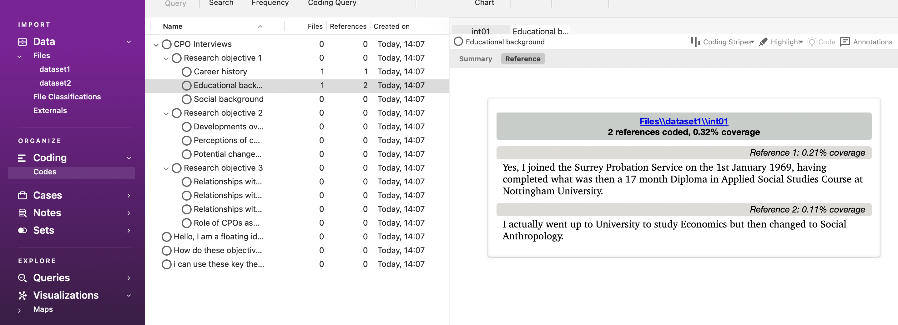

To speed up the coding, you might want to ‘drag and drop’. This is a favourite for many researchers, as coding in this way allows you to drag a highlighted selection of data onto any code showing in the List pane. This, of course, necessitates the list pane showing codes (as opposed to memos or anything else from the navigation pane). Make sure you choose Codes from the left side. Once all your codes are available on the left side of the interview document, select the part of the text you want to code, hold down the left click of the mouse and drag it onto the desired node.

<!--**IMPORTANT:** One way to speed up drag and drop coding and see the most nodes possible on the screen at one time is to rearrange the windows so that the List containing the nodes is on the left side and the Detail pane of the source is on the right side. Do this by going to **View Ribbon tab /Detail View (Window) /Right**. Then, arrange vertical splitter bars to accommodate as much text on the right as possible while seeing enough of the code labels on the left. You’ll then be able to view it like this:-->

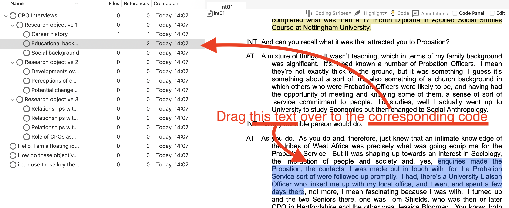
 
Theoretically, you would now read every transcript and code your data. After we've looked at inductive coding, we’ll look at what you can do with this coding.

### Activity 3: Inductive coding

It's worth creating two code folders to better organise our data and keep our nodes for our two datasets separate. We wouldn't necessarily need to do this if we were working on only one dataset. However, for now, right-click on the ‘Codes’ folder in the Codes section in the Navigation Pane. Create a folder called Dataset 1 (or something else meaningful, like 'CPOs'), then another called Dataset 2. Now, click back on the codes folder, select all the codes you created, and drag them into the Dataset 1 folder. You might need to rearrange the hierarchy again slightly. Take care not to care to create two main folders, not folders within one another (i.e., don't create dataset 2 within the dataset 1 folder, or vice-versa). We can then organise our codes according to each of the datasets.

Now, let’s start our Twitter data inductive coding. Let’s start by creating another mind map, but this time for the Twitter data. 

We’re not looking to create predetermined codes like we do with the deductive approach. Instead, we want to remain open-minded about the themes in the data. So, let’s remind ourselves of this. See if you can produce something like the following:

 
Remember, we don’t want to approach the data with too many concrete, predetermined ideas about what we will find in the data. Instead, we want to have a few open, guiding questions that will allow us to code our data as we read it. This could literally just be things you might be interested in.

So now to the hard work again. But this time, we’ll need to create our nodes **inductively** as we read through the tweets.

Start by clicking on the *Dataset 2* folder (or whatever you've called it)  in the Data section in the *Navigation Pane*, then double-clicking on the dataset in the *List Pane* to open it up in the Detail Pane. For the coding today, we’re only really interested in the tweets' texts.

Read through the tweets one by one, and each time you come across a theme of interest, code it by highlighting it, right-clicking, and choosing ‘code selection’ and then ‘to new code. ' We think the first tweet relates to ‘partnership working’, so this is what we’ve called the code. We can now go on to create more codes, and as before, some of the text might relate to more than one code. Note that once you create a new code, it might appear in your main Codes folder by default, so you should then click-and-drag it into your dataset 2 folder under 'Codes'.

As we go on, it's likely that we will end up with a hierarchy of codes and sub-codes. Remember the tip above about arranging the panes so that you can click and drag text into your code themes.
 
In theory, you’d read through all the tweets and code everything you consider important thematically in this case. You’d then read them all again, and again, and then again, and so on until you’re happy with the coding framework you’ve developed. You can do this in your own time. You could end up with hundreds of codes; you can merge codes, un-code text, delete codes, etc., until you’re satisfied.

**Tip:** The great thing about folders in NVivo is that you can change your mind, restructure them and move or drag nodes around between them whenever you like – really easily. I’ll let you explore all this in your own time. It’s all intuitive, and if you ever get stuck, we recommend watching the tutorials on the website. At the moment, these tutorials are often in an older version of NVivo (usually NVivo12) but the skills are usually easily transerable to the (newer) version that we are using.

## Abductive coding

Essentially, this involves going back and forth between the deductive approach and the inductive approaches that we've just covered. You might wish to create some pre-determined codes/nodes based on your interests and/or theory and then flexibly adapt these as you interrogate your data.

### Activity 4: Retrieval – viewing coded data

If you need to look vertically through one file at a time, reviewing what you have done, open a document and ensure Select Coding stripes /All has been selected:

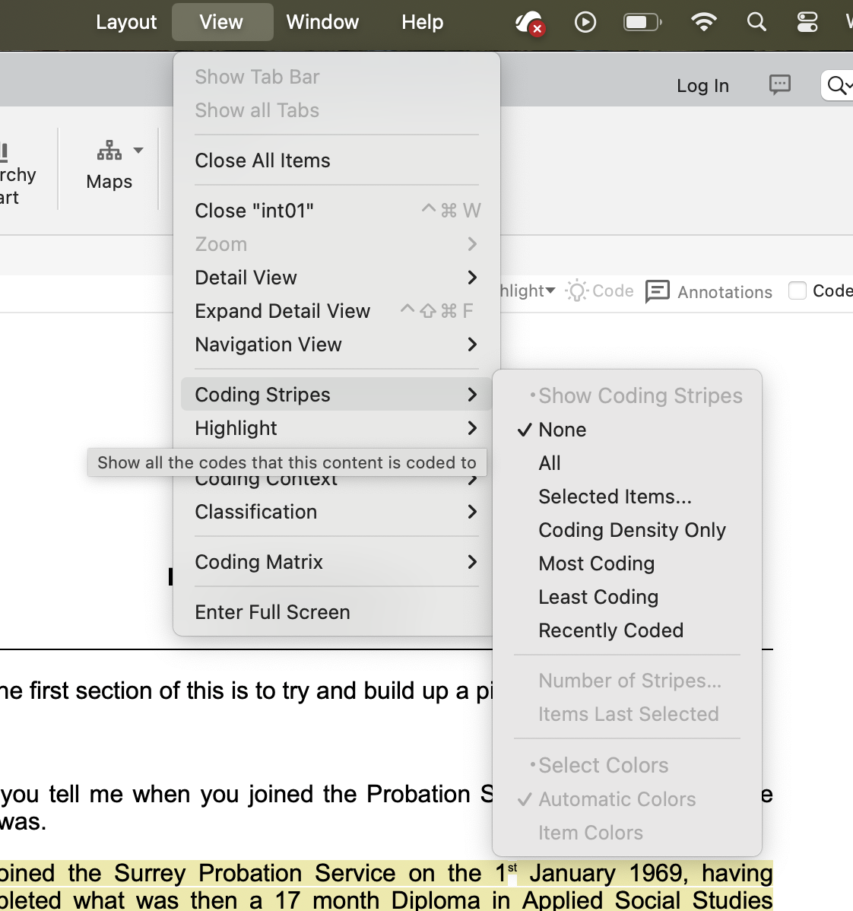

Once you have done some coding, you should review the passages you have selected for a particular code. We covered this a bit earlier, but do do so, double-click on the code you want in the List pane. This will open the code in the Detail pane. Each source that references the chosen code is listed and headed by a hyperlink back to the source.

### Activity 5: Viewing more context

It may be useful to see the surrounding context of a coding reference you’re examining. This can be done in several ways:

You can jump to the source by clicking on the blue link above the visual summary of your code. If you can't see the blue link like the one below, right-click on the passage  and select **open referenced file**. This will take you to the source and highlight the passage in which you were interested: 

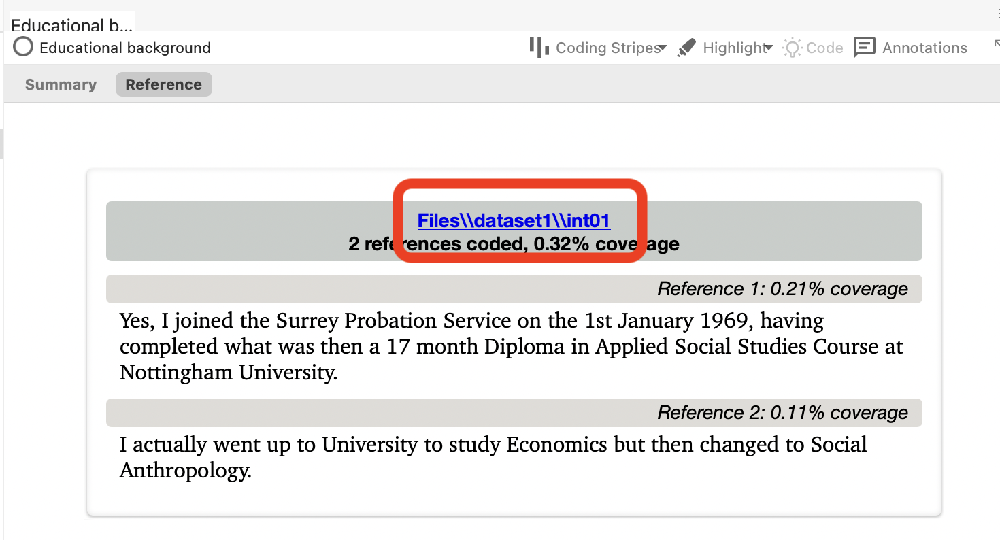
  
You can view additional content surrounding your passage of interest without going back to the whole source by right-clicking on the passage, clicking Coding Context and then and choosing how much you wish to see (e.g., narrow).

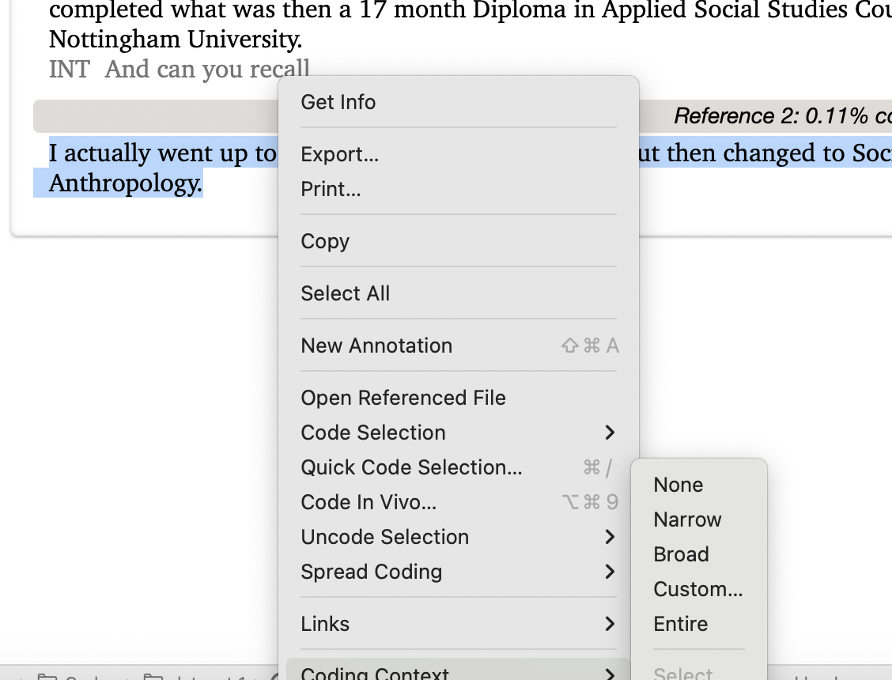
 
This will bring in your selected quantity in a way that you can differentiate it from what’s coded. At this point you can select more of it to code into that node, if you would like.

## Export coded data

There are extensive ways to output data material about your data to other formats and applications. Not all ways are included here since there are infinite combinations of settings required for different reasons, which will be based on your own particular requirements.

### Activity 6: Exporting via the list pane

This is the general and usually used qualitative form of output, which can be achieved almost anywhere in the package using different methods. This is usually required for, e.g., coded output, and it is easier to generate than the more formal reporting functions below.

In the List pane – select the item/s you want to export content for, say a Node or a Document; right-click > Export. Give this a go now with a code (or codes) for dataset 1. First, click on Dataset 1 code in the Navigation pane. Then, Right-click on the Node you want a report on (I’ve chosen the ‘Career History’ Node) and choose Export. Find a suitable location to save the data and ensure you save it as a Word file. Note that on Windows you will get some options of what to export -- you can choose the Reference View which includes `.doc` (i.e., a  Word doc). This will be the easiest to view. Now, you should have a neat overview of your Node that you could use for quotes in your essays, dissertations, or journal articles.

<!--## Reports (NOTE: WINDOWS ONLY USERS! NOT SUPPORTED BY MAC, YET!)

The formalized *Reports* and associated Extracts function (in the Navigation bar or Explore/Ribbon group) specifically concerns the support provided for mixed qual/quant methods. Some of the reports only provide quantitative information or summaries. You can just experiment with these through the Help Menu.

Two standardized Reports will also provide e.g. qualitative coded source data.

-	Coding Summary Report by *Node*
-	Coding Summary Report by *Source*

These reports are essentially the same but allow for different sorting mechanisms. This would be a quick way to export many codes at once. Experiment with all the drop-down options and Select buttons.

See if you can create a Report on your Nodes and Sources.

**MAC USERS** – play around to see what kind of things you can create. It’s all about trial and error at this stage.-->

## Some other useful things to do

Below are some more tools you might get some use out of.

### Create another Word Cloud:

See if you can replicate something like this from last week. Hint: navigate to your dataset 1 folder, select everything, then find the Word Frequency option (usually under 'Explore').

 
This is a Word Cloud for Dataset 1 only.

### Create a Word Tree:

Using the *text search* option under *Explore*, we’ve done a text search for the words **Career** in Dataset 1. 

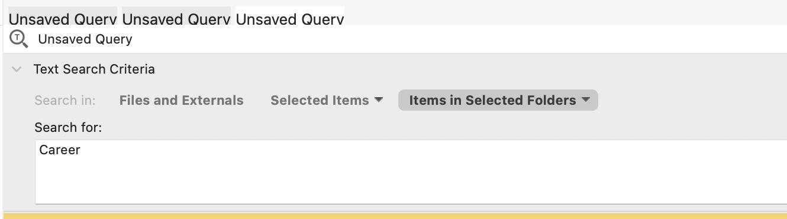

Then, choose the *‘Word Tree’* option (see above screenshot - grey button) to better understand the key discourse around the term. In Windows, the Word Cloud option might be in a tab on the right-hand side. Our query produced the following. Are there any relationships here? You can better understand the word tree by interacting with it via clicking around.

Note that our word tree below is just an example -- yours might look different (probably bigger!).

 
While you can export your Word Tree into jpeg or PDF form, in NVivo, you can also click on the different branches to better understand the connections interactively. Try it out.

It's worth knowing that you can search for multiple words at once using a specific syntax. A full example for multiple words would be something like **‘Career’ AND ‘Probation’ AND ‘Money’ AND ‘Lifestyle’**. You don't need to know this in detail for now but you can read more about it [online](https://help-nv.qsrinternational.com/12/win/v12.1.115-d3ea61/Content/queries/text-search-query.htm) if you want.

<!-- ### Create a Concept Map (WINDOWS ONLY!) -->

<!-- Windows users might want to create a concept map to connect data to different ideas and thoughts. It is very similar to the Mind Map function that we did earlier. You can learn more about it [here](https://www.youtube.com/watch?v=NRSPP6eZd0s). -->

## Other features…

Finally, here are some features that some of you may wish to make use of. Much of the *qualitative data* used in criminology is textual in that we often carry out interviews with offenders, victims and law enforcement. 

But you might be interested in generating different data, such as audio or visual:

### Graphics/pictures - making linked notes and coding

Try importing a picture. Find something online and save it. Then import it. Here’s our example:

 
With the picture on view, click to edit or enable the editing feature. You can then:

-	Make a selection within the graphic, right-click, insert a row, and write notes.
-	Make a selection/right-click/Code selection. 
-	Code the notes instead

Have a play with coding and analysing pictures.

### Coding audio/video data

Coding multimedia data is very similar to coding textual data. For either audio or video sources, you can select transcript text and code as usual, or you can select a segment on the progress bar and code that is directly as if you’d highlighted text.

So, if you have some music on your computer, try importing a song to see what it looks like, and then see if you can code lyrics and sections of the song.

<!-- ## More on capturing web material -->

<!-- Last week, we imported web pages for our media articles and saved them as PDFs. But another, and actually better, way of doing this is by using **NCapture** (a web browser extension, search for it in your browser to install). -->

<!-- A growing variety of web content and social media is available to you using NCapture, a web browser extension that is available for free with NVivo. It allows you to capture and import a screenshot of any webpage as a PDF or various social media sites (such as Twitter, Facebook, and LinkedIn) as a dataset (table). -->

<!-- To learn more about this, click [here](https://www.youtube.com/watch?v=ciwMX4Xvu_s&ab_channel=DrPaulinePrevettandDrHaleemaSadiaMian). -->

<!-- Once you have NCapture installed, open your browser and navigate to the website of interest. You’ll need to do this on your personal machines as it is unlikely to be installed on the lab computers. -->

<!-- Once installed, the process is as follows: -->

<!-- -	Click the *NCapture* icon in your browser bar -->
<!-- -	A dialogue box opens (right) -->
<!-- -	Choose your source type (probably ‘Web Page as PDF’), source name, optional description, memo nodes, etc. -->
<!-- -	Click Capture -->
<!-- -	See the NCapture Progress page below -->

<!-- **NOTE:** WEB PAGES ARE CAPTURED USING THE PDF OPTION – SOCIAL MEDIA WOULD BE CAPTURED USING THE DATASET OPTION -->

<!-- -	Go to the Sources section of the Navigation pane > Internals > Web Content subfolder (or wherever you’d like the new Sources to be created)  -->
<!-- -	Go to the External Data Ribbon tab > From Other Sources > From NCapture (as seen left)  -->
<!-- -	A dialogue box opens, as seen below, showing recent captures. Choose the captures you’d like, and click Import. Webpages will be brought in as PDFs; and social media files as tables, depending on your choices during capture. -->
<!-- Then, analyse as we have been doing in the sessions. -->

## Summary

You can use your nodes to build your ideas and theories or identify evidence to support your theoretical propositions. You can focus on particular themes, compare across nodes and the data, and extract to support your academic work in a systematic way. Using *NVivo* gives you structure and management for your data, helps you develop clear organizing and conceptual frameworks, and allows you to interrogate the data at different levels and in different directions.

